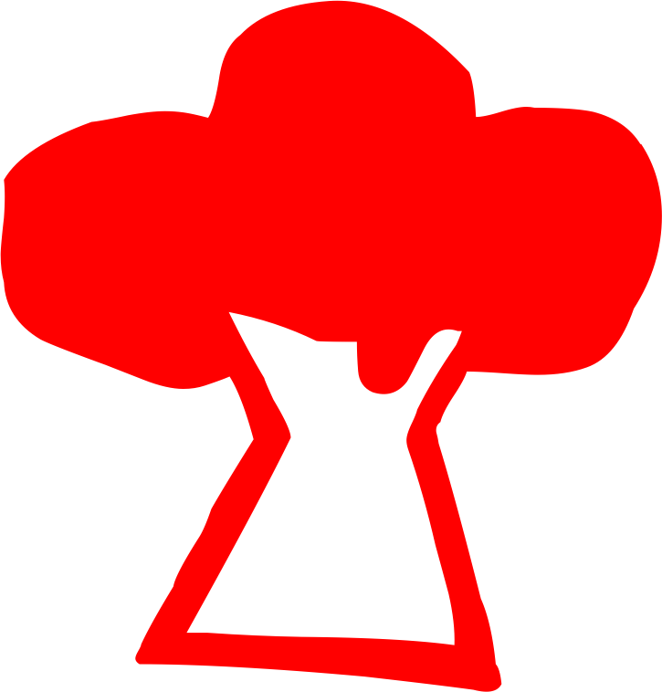

----

####################
Le personnage joueur
####################

Description et Création
=======================

La première chose que doit faire un joueur avant de commencer une partie de jeu
de rôle, c’est de choisir le personnage qu’il va incarner. S’il est débutant,
indécis ou pressé, nous lui conseillons de choisir un personnage prétiré,
c’est-à-dire un personnage tout fait. Il y en a six de prévus, que vous
trouverez dnas le HS11, dont vous pouvez vous inspirer et qu’il est possible de
photocopier ou même de découper.

Un paradoxe de la création de personnage dans le jeu de rôle est qu’il faut
souvent un peu savoir comment «fonctionnent » les règles pour savoir si son
personnage correspond bien à ce que l’on veut, mais que l’on ne peut bien
saisir le mécanisme des règles qu’après avoir créé un personnage. C’est un peu
le problème de l’œuf et de la poule. Mais ne paniquez pas, tout cela n’est pas
si compliqué.

Le plus simple, c’est de lire la description des caractéristiques d’un
personnage avec une feuille vierge (page :pageref:`fdp-base`) devant soi, ou
avec un des prétirés.  Vous pourrez créer un personnage au fur et à mesure,
puis passer aux mécanismes du jeu (page 10 et suivantes) pour savoir comment va
« fonctionner » votre personnage.

Les Caractéristiques
====================

Elles sont divisées en plusieurs catégories. Voici, pour chacune, comment
remplir la feuille de personnage, lorsque vous en créez un.

Composantes
-----------

Ce sont les matériaux qui composent les individus, la base même de ce qu’ils
sont. Un personnage est composé (symboliquement) du Corps, des Instincts, du
Cœur et de l’Esprit.

**Le Corps** sert à résoudre toutes les situations physiques (courir, regarder,
lutter, danser, écouter, etc.). Il recouvre diverses capacités physiques comme
la force, l’agilité, l’endurance.

**Les Instincts** regroupent toutes les forces et les faiblesses cachées et
inconscientes de l’individu.  C’est par eux que s’expriment le sixième sens,
l’intuition, le côté animal du personnage ; mais aussi le fait de se laisser
dominer par ses pulsions. Une personne instinctive pourra sentir des présences,
se rattraper de justesse lors d’une chute, etc.

**Le Cœur** est le domaine des sentiments (aimer, se faire aimer, « comprendre
», ressentir, influencer, convaincre par les sentiments, etc.). Quelqu’un qui a
une forte valeur en Cœur peut non seulement mieux convaincre, mais aussi mieux
résister aux influences extérieures, alors qu’un personnage avec une faible
valeur sera plus velléitaire (incapable de s’en tenir à une décision prise).

**L’Esprit** gouverne la réflexion (calculer, analyser, raisonner, prévoir,
persuader par la raison, etc.) mais aussi l’invention, l’imagination.

.. sidebar:: *Création du personnage*

   Les valeurs des Composantes varient de 3 (faible) à 6 (fort), 4 et 5 étant
   des valeurs moyennes. Répartissez un total de 18 points entre vos quatre
   Composantes.
   Exemple : Corps |corps| 5, Instincts |instinct| 6, Cœur |coeur| 4, Esprit
   |esprit| 3 ; un tel personnage est très instinctif, privilégiant ce qui est
   physique, moyennement amical et pas du tout réfléchi. Une vraie tête brûlée.

.. raw:: latex

    \begin{figure*}[b!]
    \begin{minipage}{\textwidth}

.. image:: images/tableau_principal.pdf
    :width: 13cm
    :align: center

.. raw:: latex

    \end{minipage}
    \end{figure*}

Moyens
------

Les Composantes ne sont que des potentialités qui ne sont pas toujours bien
exploitées ou exprimées. Il ne sert à rien d’avoir de beaux muscles si on ne
les utilise pas, d’avoir un grand cœur si on n’aime personne. L’expression
d’une Composante se fait toujours à travers un Moyen.  Ainsi Esprit |esprit| et
Perception |perception| servent à appréhender un problème intellectuel, alors
que Corps |corps| et Action |action| servent à donner un coup de poing ou faire
un saut en longueur. Le tableau ci-dessous résume ces diverses combinaisons.

.. raw:: latex

    \pagebreak

Les Moyens sont au nombre de quatre :

**La Perception.** Elle sert chaque fois que l’on veut connaître quelque chose.
On l’utilise aussi dans tous les cas où il est plus important de réagir
qu’agir.  Ainsi, pour éviter une voiture qui grille un feu rouge, c’est la
Perception que l’on utilisera, pour déterminer si on a vu la voiture à temps.
De même, le fait de viser, même pour utiliser un fusil, se fera avec la
Perception.

**L’Action.** Ce Moyen sert lorsque l’on doit avoir une action effective. C’est
le plus évident à comprendre, et aussi l’un des plus utilisés des Moyens.
L’Action servira pour un bras de fer comme pour résoudre une énigme.

**Le Désir.** Ce Moyen représente toutes les sortes de volontés, qu’elles
soient conscientes ou inconscientes. C’est sans doute le Moyen le plus
difficile à appréhender, mais aussi celui qui a le plus de possibilités. On
peut ainsi « désirer » survivre, inventer des engins ou des poésies
extraordinaires; bref, arriver à se dépasser.

**La Résistance.** C’est un Moyen passif, qui sert à tester si on résiste à une
agression physique, morale ou sentimentale, ou si on se laisse guider par ses
instincts.

.. sidebar:: *Création du personnage*

   Les valeurs des Moyens varient de 0 (très faible) à 4 (fort) ; 2 étant une
   valeur moyenne. Attribuez un total de 10 points pour l’ensemble de vos
   Moyens. Il est possible, mais déconseillé, de mettre un score de 0 dans un
   des Moyens. 

   Exemple : Perception |perception| 2, Action |action| 3, Désir |desir| 3,
   Résistance |resistance| 2; ce qui indique un personnage assez moyen, plutôt
   actif, pas très perspicace, qui ne sait pas trop encaisser les coups durs,
   mais qui sait y réagir efficacement.

.. raw:: latex

    \begin{figure*}[t!]
    \begin{minipage}{\textwidth}

.. admonition:: Une autre méthode pour créer ses Composantes

    .. image:: images/autre_methode_composantes.pdf
        :width: 5cm
        :align: right
    
    Sur la feuille de personnage, les cadres où l’on inscrit le score des
    Composantes comportent trois petites cases. Celles-ci servent si vous désirez
    créer vos personnages d’un façon plus imagée. Comment procéder :
    
    Pour chaque Composante, la première case représente votre potentiel à votre
    naissance |s| ; la deuxième case est la façon dont elle a évolué au cours
    de votre enfance et votre adolescence, suite à votre éducation et votre
    milieu ; la troisième case représente vos propres efforts d’amélioration.
    Si vous décidez que la valeur d’une case est forte, noircissez-la. Si vous
    décidez qu’elle est faible, laissez-la en blanc. Pour l’ensemble des quatre
    Composantes, vous devez noircir 6 cases, et en laisser 6 en blanc. Ensuite,
    calculez la valeur de chaque Composante en sachant qu’une case blanche vaut
    1 point, et qu’une case noire vaut 2 points.  Voyons, d’après l’exemple
    ci-contre, comment interpréter ce processus de création. Ce personnage a
    une valeur de Corps |corps| de 5 (2+1+2), qui lui vient d’une bonne
    constitution à la naissance, qu’il n’a pas vraiment travaillé durant son
    adolescence, mais qu’il a augmenté par la suite par des exercices et une
    bonne hygiène de vie.
    
    Paradoxalement, cette méthode de création n’est pas plus compliquée. Elle
    permet de mieux visualiser son personnage (ce qui est souvent utile aux
    débutants) et de faire des différences entre des personnages qui, globalement,
    auraient les mêmes caractéristiques.

.. raw:: latex

    \end{minipage}
    \end{figure*}

Règnes
------

Enfin, on n’agit pas dans l’absolu. Chaque personne a des affinités
particulières vis-à-vis du milieu extérieur.  Ainsi, même si on utilise ses
facultés de perception, certains individus sont plus à l’aise pour suivre les
traces d’un animal dans la forêt, alors que d’autres sauront plus facilement
déceler un passage secret dans une bâtisse. Dans le jeu, ces affinités sont
appelées les Règnes, et sont au nombre de cinq : Minéral |mineral|, Végétal
|vegetal|, Animal |animal|, Humain |humain|, Mécanique |mecanique|.

**Minéral.** Ce Règne représente toute la nature non vivante. C’est-à-dire les
rochers, les pierres, mais aussi l’eau (océans, lacs, rivières) ou l’air (le
vent, le ciel). Ainsi, lorsque l’on veut faire le point en mer, ou connaître la
météo, on utilise le Règne Minéral.

|s|

**Végétal.** Ce Règne représente tout ce qui est vivant et (a priori) sans
conscience. On l’utilise avec les plantes, les arbres, les lichens.

**Animal.** Ce Règne sert à chaque fois que l’on a des interactions avec des
créatures vivantes qui ont un comportement instinctif (que l’on nomme animal)
plutôt qu’intellectuel (comme les humains). C’est pourquoi il arrive que ce
Règne soit utilisé dans des circonstances particulières avec des humains : si
un Indien essaye d’appeler son animal totem, si un officiant vaudou se livre à
son dieu loa, ils font appel à la personnalité animale qu’ils possèdent en eux.

**Humain.** Ce Règne est un des plus importants car il est utilisé de deux
façons bien différentes. Dans un premier temps, comme tous les autres Règnes,
on l’utilise dans les interactions avec d’autres humains (séduction,
psychologie...). Dans un deuxième temps, il sert dès qu’on utilise ses propres
capacités (courir, résoudre une énigme...). En fait, le jeu part du principe
philosophique grec : connais-toi toi-même pour connaître les autres. Il peut
arriver que l’on ait des interactions avec des créatures qui ne soient ni
animales (elles réfléchissent) ni humaines (elles ont des modes de pensée trop
étranges pour nous |s| ; comme des extraterrestres, des dieux non
anthropomorphes...) auquel cas aucun de ces deux Règnes (Animal et Humain) ne
s’applique.

**Mécanique.** Ce Règne représente tout ce qui est utilisé comme outil ou
instrument, au sens le plus large du terme. Ainsi l’os, qui pourrait être
considéré comme Minéral (en voie de fossilisation) est considéré comme un outil
dès que l’homme des cavernes l’utilise pour la chasse ou la guerre (voir 2001
l’odyssée de l’Espace ). Évidemment, les voitures, les armes à feu, les
presse-purées, les ordinateurs, sont tous du domaine Mécanique. Mais cela va
plus loin, car on considérera aussi que les lois de la physique et des
mathématiques sont des « |s| outils |s| » pour comprendre l’univers. Ainsi, si
un psychiatre veut inventer une nouvelle méthode psychiatrique, il utilisera le
Règne Humain, car son domaine d’application est l’esprit humain ; mais un
physicien voulant découvrir de nouvelles lois des interactions interatomes
utilisera le Règne Mécanique (même si c’est avec son cerveau qu’il réfléchit).

.. image:: images/regnes.pdf
    :width: 6cm
    :align: center

.. sidebar:: *Création du personnage*

   Les valeurs des Règnes varient de 0 (faible) à 2 (fort), 1 étant la valeur
   normale. L’attribution des points à répartir, ainsi qu’un exemple de
   création, sont donnés un peu plus loin, après les Énergies.

Énergies de base
----------------

Chaque individu possède en lui des possibilités de dépassement qu’il est
capable de révéler dans des circonstances extrêmes. Lors d’un sursaut de
volonté, ou en se concentrant, il peut libérer ces capacités pour changer le
cours du destin. Cette capacité particulière s’appelle l’Énergie. Attention,
l’utilisation des Énergies engendre une dépense physique ou psychique
(expliquée dans les mécanismes du jeu, voir page 10 et suivantes) et il vaut
mieux les considérer comme des « |s| jokers |s| » (qui typent un peu plus les
personnages) que de compter tout le temps sur elles.

Il y a trois Énergies de base :

**La Puissance** permet d’augmenter les chances de réussite et les résultats
d’une action. Cette Énergie n’est utilisable que quand une certaine « |s| force
|s| » est applicable. Ainsi, on peut ajouter de la Puissance à un coup de
poing, à une tentative de séduction, au dépouillement d’un volumineux dossier
d’enquête.  Mais on ne peut donner de la Puissance à un coup de feu (c’est le
pistolet qui tire), à la conduite d’une voiture, etc.

|s|

**La Rapidité** permet d’augmenter les chances de réussite et les résultats
d’une action. Évidemment, cette Énergie n’est utilisable que dans des
circonstances où la rapidité joue un rôle. C’est le cas du combat au contact,
des poursuites où les réflexes jouent, si une action est faite dans la
précipitation...

**La Précision** permet aussi d’augmenter les chances de réussite et les
résultats d’une action.  Évidemment, cette Énergie n’est utilisable que dans
des circonstances où la précision joue un rôle, comme viser une cible, savoir
trouver le mot juste. La Précision peut en fait servir quasiment tout le temps,
sauf dans les circonstances passives (comme résister à une maladie, à un
hypnotiseur) où seule la Puissance peut servir.

.. sidebar:: *Création du personnage*

   À l’instar des Règnes, les Énergies ont une valeur de 0 (moyenne), 1
   (supérieure) ou 2 (forte). Comme les Énergies sont des « |s| bonus |s| » par
   rapport à la moyenne, une valeur de 1 n’est pas « |s| normale |s| » (comme
   pour les Règnes) mais déjà considérée comme supérieure. En effet, le Règne
   est utilisé tout le temps alors que l’Énergie ne pourra servir que de temps
   en temps.

   L’attribution des points à répartir, ainsi qu’un exemple de création, sont
   donnés un peu plus loin.

Autres Énergies
---------------

Il existe d’autres Énergies mais elles dépendent du contexte, de l’univers de
jeu que vous avez choisi. Cela peut être de l’Énergie magique, psionique, etc.
A priori, vous n’avez pas à en créer vous-même, mais votre personnage peut être
amené à utiliser cette Énergie, auquel cas vous devrez à chaque fois consulter
les règles spécifiques. Notez simplement que votre personnage ne pourra avoir
ces capacités spéciales que s’il a mis des points dans cette Énergie. Ainsi,
par exemple, si vous jouez dans un univers magique où les sorciers sont une
réalité, il existera une Énergie de sorcellerie. Si votre personnage a des
points dans cette Énergie, il pourra être ou devenir sorcier |s| ; sinon, la
sorcellerie lui sera totalement inaccessible.

.. image:: images/energies_de_base.pdf
    :width: 5cm
    :align: center

.. sidebar:: *Création du personnage*

   En tout, pour l’ensemble des Règnes et Énergies, vous disposez d’un total de
   8 points. Comme il y a 5 Règnes et 3 Énergies de base, cela vous permet de
   mettre 1 point partout. Si vous choisissez d’avoir un personnage moins
   équilibré, le minimum dans un Règne ou une Énergie est de 0, le maximum de
   2.  S’il existe une Énergie supplémentaire dans un univers de jeu (comme la
   magie), le total des points n’augmente pas et est toujours de 8. De plus,
   cette Énergie spéciale ne peut pas être montée à 2 (seulement à 0 ou à 1).

   Exemple : Minéral |mineral| 0, Végétal |vegetal| 0, Animal |animal| 1,
   Humain |humain| 2, Mécanique |mecanique| 2, Puissance |puissance| 2,
   Rapidité |rapidite| 1, Précision |precision| 0 |s| ; ce personnage ne
   connaît pas grand-chose de la nature en général, à peine les animaux, par
   contre il a des affinités avec les humains et leurs outils. De plus, il est
   très costaud, et plus rapide que précis.

L’état du personnage
====================

Trois compteurs distincts indiquent quel est l’état actuel de votre personnage.
En effet, celui-ci va vivre des aventures mouvementées et trépidantes, pleines
de danger. Il est bien possible qu’il soit blessé, essoufflé, choqué (pire, il
peut mourir). Pour savoir où il en est, on utilise trois compteurs de « |s|
points |s| » : les points de vie, les points de souffle, et les points
d’équilibre psychique.

Points de vie
-------------

Les **points de vie** (en abrégé : PV) indiquent la quantité de dégâts
physiques que peut subir le personnage, avant d’être blessé ou de mourir. Le
total maximum de ses points de vie dépend de sa morphologie. Pour la connaître,
additionnez ses scores en Corps |s| |corps| et Résistance |s| |resistance| :

- De 1 à 5, sa morphologie est faible.
  Il a 4 points de vie.
- De 6 à 8, sa morphologie est moyenne.
  Il a 5 points de vie.
- De 9 à 14, sa morphologie forte.
  Il a 6 points de vie.

Si à un moment votre personnage tombe à 0 point de vie, il est mort, la partie
est terminée pour vous. S’il est blessé, et que sa blessure a été soignée, il
récupérera 1 point de vie par jour. Dans les univers magiques, il existe des
potions qui aident à guérir plus vite, de même que des soins dans un hôpital
ultramoderne peuvent accélérer cette récupération. Quelle que soit la façon
dont les points de vie sont récupérés, leur nombre ne peut dépasser le maximum
indiqué par la morphologie.

Points de souffle
-----------------

Tous les personnages ont 4 **points de souffle** (en abrégé : PS). Ces points
peuvent être perdus quand ils reçoivent des coups d’objets contondants
(matraque, coup de poing...) ou quand ils font des efforts (en général quand on
utilise ses Énergies, la manière dont cela se déroule est expliquée dans les
mécanismes de jeu, pages 10 et suivantes). Si le personnage tombe à 0 point de
souffle, il perd conscience. Les points de souffle se récupèrent naturellement
au rythme de 1 point par heure de repos. On ne peut dépasser le maximum de ses
points de souffle.

Points d’équilibre psychique
----------------------------

Tous les personnages ont 4 **points d’équilibre psychique** (en abrégé : EP).
Ces points peuvent être perdus quand ils subissent des chocs psychologiques
(terreur, perte d’un être aimé...) ou s’ils se concentrent pour augmenter leurs
chances de réussite (en général quand on utilise les Énergies, la manière
dont cela se déroule est expliquée dans les mécanismes de jeu, pages 10 et
suivantes). Si le personnage arrive à 0 point d’équilibre psychique, il devient
fou ou tombe en état de choc. Les points d’équilibre psychique se récupèrent
naturellement au rythme de 1 point par semaine de calme. On ne peut dépasser le
maximum de ses points d’équilibre psychique.

Résistance magique
------------------

Cette résistance sert à ne pas succomber à certains sortilèges (voir comment
l’utiliser dans les règles de magie, p. :pageref:`magie`). Pour la calculer, faites
la somme Esprit |esprit| + Résistance |resistance| + Humain |humain| + Art
magique (Art magique est un talent, qui rend la somme précédente nulle si vous
ne le possédez pas). Si cette valeur est supérieure à 6, notez-la, sinon
indiquez 6 dans l’emplacement réservé sur la feuille de personnage. Attention,
les Elfes et les Nains diminuent cette valeur de 1 point.

La vie du personnage
====================

Un personnage n’est pas qu’un assemblage de chiffres et de caractéristiques. Il
est aussi défini par ce qu’il a vécu, ce qu’il sait faire, et par ses
possessions.

Le passé
--------

Ici, vous êtes tout à fait libre de créer le passé que vous voulez à votre
personnage, pourvu qu’il soit cohérent avec l’univers de jeu, et que votre
meneur de jeu approuve vos choix. Évitez quand même les fils d’empereur cachés
qui ont pour destin de régner sur l’univers. Votre but est de forger un destin
à votre personnage durant le jeu, pas de décider à l’avance qu’il est un
surhomme.

.. raw:: latex

    \begin{figure*}[b!]
    \begin{minipage}{\textwidth}

.. admonition:: Force et Agilité ?

    .. class:: small
    
        Les joueurs habitués à d’autres jeux de rôle sont souvent surpris par
        la façon de décrire les personnages dans Simulacres. En effet, il est
        plus courant de trouver des caractéristiques plus descriptives (et plus
        nombreuses) comme Force, Dextérité, Intelligence, Volonté, que celles
        plus générales comme Corps ou Cœur. C’est en effet souvent plus facile
        à comprendre au premier abord, mais il ne faut pas oublier que
        Simulacres est destiné à faire jouer dans n’importe quel univers ou
        situation, et qu’il doit donc être plus générique et moins spécifique.
        En fait, la capacité de combiner Composantes et Moyens donne déjà de
        nombreuses possibilités, et c’est sans compter l’interprétation que
        peuvent apporter les Énergies.
        
        Ainsi, qu’un personnage veuille faire un bras de fer ou se saisir d’un
        objet avant un adversaire, on se servira du Corps, de l’Action et du
        Règne Humain.  Mais celui qui aura plus de Puissance augmentera ses
        chances au bras de fer, alors que celui qui aura le plus de Rapidité
        augmentera ses chances d’être le premier à saisir l’objet. Ses
        mécanismes s’appliquent de la même manière à des tâches intellectuelles
        (trier des renseignements, résoudre des équations, avoir la plus grande
        force de conviction...). Tout cela donnant un nombre de combinaisons et
        de façons différentes d’utiliser ses capacités vraiment impressionnant.
        Ainsi, ce qui fait la différence entre un bagarreur et le champion du
        monde de boxe, qui pourront tous deux assommer n’importe quel quidam,
        ce sera leurs métiers et leurs Énergies.

.. raw:: latex

    \end{minipage}
    \end{figure*}

Talents et métiers
------------------

Votre personnage a le droit à un métier, deux talents et deux hobbies.

- **Un métier** est un ensemble de compétences qui permettent à votre
  personnage de se sortir de toutes les situations normales où ce métier peut
  servir. Il donne également des bonus à vos chances de réussite. N’importe
  quel type de métier connu du MJ peut être choisi, aussi bien ceux qui sont
  classiques (médecin, soldat, pilote, caissière de supermarché...) que des
  vraiment « exotiques » (fils d’industriel, gourou, agitateur politique...).

- **Un talent** est une compétence qui permet à votre personnage de se sortir
  de toutes les situations normales où ce talent peut servir. Il n’est pas
  nécessaire de posséder un talent en rapport avec votre métier puisque
  celui-ci les contient déjà. Ainsi, un talent de premiers soins est inutile
  pour un médecin. Les talents peuvent recouvrir des capacités bien différentes
  (prestidigitation, cuisine, armes à feu...). Il existe une liste de talents
  dans les règles de campagne, p. :pageref:`campagne-start`\ -\ :pageref:`campagne-end`.

- **Un hobby** est un domaine où votre personnage possède quelques
  connaissances et quelques compétences, en général au niveau amateur. Un hobby
  offre moins de pratique et de connaissance qu’un talent. Il est là pour
  donner un peu plus de « relief » à votre personnage.  Exemples de hobbies :
  philatélie, pêche à la ligne, jeux de rôle, fan de séries télés... Vous
  pouvez échanger vos deux hobbies contre un talent supplémentaire. Ou au
  contraire transformer un de vos deux talents en deux hobbies supplémentaires.

Points d’aventure
-----------------

Ne vous préoccupez pas pour l’instant de cette case.  Elle sert pour les règles
de Campagne (p. :pageref:`campagne-start`).

.. raw:: latex

    \clearpage
    \pagebreak
    \label{fdp-base}
    \includepdf[pages=-]{images/Fiche_de_perso_v7_base.pdf}

