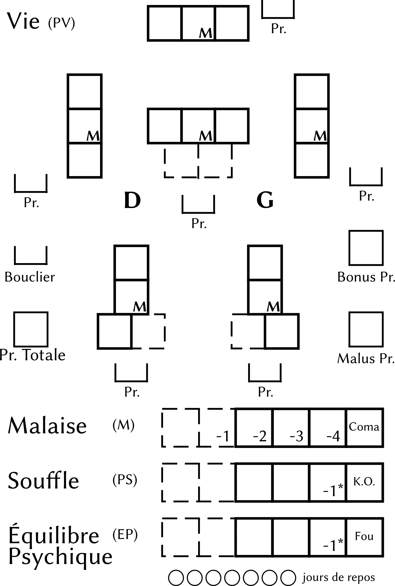

.. raw:: latex

    \clearpage
    \pagebreak

###################
Règles optionnelles
###################

:label:`regles-optionnelles-generales`

.. class:: center 

 .. class:: red

  **En jeu de rôle, chacun voit un peu midi à sa porte. Certains trouvent que
  des règles de six pages sont déjà trop compliquées, d'autres ne supportent
  pas que tous les détails concernant les armes ne soient pas pris en compte.
  Il ne faut pas oublier que le but premier du jeu de rôle s'est de s'amuser.
  Et chacun a sa façon de s'amuser. Pour ceux qui aiment les détails, voici des
  règles optionnelles, compatibles avec les règles de base, mais plus
  particulièrement destinées à compléter les règles de campagne.**

Localisation des points de vie
==============================

Pour suivre les explications, consultez la mini fiche ci-dessous. Elle est
extraite de la feuille de personnage complète (voir p. :pageref:`fdp-localise`), que
vous pourrez photocopier. Vous y remarquerez un nouveau compteur: le malaise.
Pour l'instant, ne tenez pas compte des indications Bouclier ou Pr.
(protection), elles ne servent qu'avec la nouvelle règle sur les armures (voir
plus loin).

Pour connaître la répartition des points de vie de votre personnage, commencez
par calculer la somme Corps |corps| + Résistance |resistance|. S'il a |s| :

- de 1 à 5 points, sa morphologie est faible, laissez la fiche en l'état |s| ;
- de 6 à 8, sa morphologie est moyenne, ajoutez une case sur le tronc (zone 2)
  et au malaise.  Ces cases sont déjà en place, mais en pointillé |s| ;
  noircissez-en le contour au stylo |s| ;
- de 9 à 14, sa morphologie est forte, ajoutez les deux cases du tronc et les
  cases des jambes, plus les deux cases supplémentaires du malaise.

Les cases en pointillé pour le souffle et l'équilibre psychique serviront pour
des gains futurs (par les points d'aventure).

.. raw:: latex

    \begin{figure*}
    \begin{minipage}{\textwidth}

.. image:: images/repartition_pv_localises.pdf
    :width: 15cm
    :align: center

.. raw:: latex

    \end{minipage}
    \end{figure*}

Perte de points de vie, gain de malaise
---------------------------------------

À chaque fois que l'on perd des points de vie (PV), on détermine en lançant un
dé à 6 faces la zone touchée (à moins que l'adversaire n'ait visé une zone
précise), et on coche le nombre de PV perdus dans cette zone (en commençant
toujours par les cases les plus en haut et à gauche, puis en allant vers la
droite, puis le bas). Dès qu'une zone a encaissé une perte de 2PV (case notée
M), on coche, en partant de la gauche, une case du compteur de malaise (M).
Cela signifie que le personnage a reçu une blessure grave et qu'il s'en trouve
handicapé.

Une attaque qui fait des dégâts non localisés (une bombe, un incendie) cause
des dégâts dans chaque zone, et retire généralement des points de souffle (la
perte de points de souffle est par contre calculée une seule fois). On peut
aussi attribuer des points de malaise quand le personnage est très malade,
empoisonné ou que des brûlures ne sont pas encore bien guéries.

 .. class:: darkred

  *Exemple :* Une grenade explose à côté d'Arthur. Le tableau des armes indique
  qu'une grenade au point d'impact inflige normalement[F]PV et [F]PS. Il est
  précisé qu'en cas de localisation, les dégâts en PV sont diminués de deux
  colonnes. Ce qui donne [D]PV : Arthur Perd 1PV à la tête, 2 au torse, 1 au
  bras gauche, 2 au bras droit, 3 à la jambe gauche, 1 à la jambe droite. Trois
  cases de malaise sont cochées, ce qui amène Arthur dans la case indiquée par
  un petit -3. On tire aussi la perte de points de souffle, une seule fois, ce
  qui donne une perte de 3PS. Arthur est vraiment très gravement blessé. Mais
  c'est normal avec une grenade !

Conséquences
------------

- Chaque fois que l'on coche une case de malaise, on regarde le petit chiffre
  qui est inscrit dans cette case. C'est le modificateur à appliquer à tous les
  **tests** suivants (physiques ou intellectuels).  Vous remarquerez qu'un
  personnage avec une bonne morphologie est moins gêné par le malaise qu'un
  petit malingre. Si le maximum des points de malaise est atteint, on tombe
  automatiquement inconscient.

- Tant que l'on n'a pas perdu tous les PV d'une zone, on peut encore se servir
  de cette zone. Une fois tous les PV perdus, la zone devient inutilisable.
  S'il s'agit de la tête ou du tronc, cela peut entraîner la mort, surtout si
  l'on n'est pas soigné très vite. Si c'est un des quatre membres, on fait un
  **test** Corps |corps| + Résistance |resistance| + Humain |humain| pour
  déterminer si on ne tombe pas inconscient pour la passe d'armes suivante.

- Si on perd dans une zone plus de PV qu'elle n'en possède, le membre concerné
  peut être définitivement perdu, ou subir des séquelles (voir règle plus
  loin).

- Règle optionnelle pour les meneurs de jeu sadiques: quand il ne reste plus au
  personnage qu'un seul point de souffle (PS), ou point d'équilibre psychique
  (EP), on peut lui donner un malus de 1 aux tests physiques et intellectuels.

 .. class:: darkred

   *Exemple:* Arthur a été blessé par une grenade (voir exemple précédent), il
   a un malus dû au malaise de -3 à tous ses **tests**.  De plus, il a aussi
   perdu 3PV à la jambe gauche. Il doit réussir un test Corps |corps| +
   Résistance |resistance| + Humain |humain| -3 pour ne pas s'évanouir (les -3
   dus au malaise sont applicables immédiatement).

Récupération des points de vie et du malaise
--------------------------------------------

Suite à une blessure, il est possible de recevoir des premiers soins. On peut
faire un test par zone touchée, mais plusieurs soins de suite sur la même zone
ne sont pas autorisés. Dans les univers « normaux » le test est Corps |corps| +
Perception |perception| + Humain |humain| + Premiers soins + **difficulté**. La
**difficulté** dépendant du matériel disponible et des connaissances médicales
en vigueur dans l'univers concerné. Si on possède les **talents** Médecine et
Premiers soins, c'est le meilleur des deux que l'on utilise. La différence
entre ces deux **talents**, c'est que Médecine permet, en plus, de soigner et
de diagnostiquer des maladies. En cas de réussite, la zone blessée regagne
automatiquement 1PV.

Une fois soigné, chaque jour de repos complet permet de récupérer IPV par zone
blessée. Toute activité durant cette journée, ou toute blessure non pansée,
peuvent compromettre la guérison. Le blessé doit faire un **test** Corps
|corps| + Résistance |resistance| + Humain |humain|, par zone touchée, pour
déterminer s'il regagne ou non 1PV. Un échec critique lors d'un test sur une
blessure non pansée fait perdre 1PV, au lieu de garder l'état stationnaire ou
d'en gagner un.

À chaque fois que l'on repasse sous la barre des 2PV cochés dans une zone
donnée, on gagne un point sur le compteur de malaise.

Séquelles
---------

- Si une zone blessée tombe à 0PV, elle peut être définitivement perdue. Il
  faut réussir très vite un **test** de Premiers soins (ou Médecine) pour la
  sauver.  Ce temps de réaction est directement proportionnel à la Résistance
  |resistance| du personnage. Si la blessure est à la tête, on calcule ce temps
  en nombre de passes d'armes |s| ; au torse, en minutes |s| ; ailleurs, en
  heures.  Ainsi, un personnage qui a 3 en Résistance |resistance| et qui est
  tombé à 0PV à la tête doit être soigné dans les 3 passes d'armes suivant la
  blessure.

  Quand ce délai est écoulé, le personnage a encore droit à une dernière
  chance |s| ; s'il réussit un **test** dit de survie: Corps |corps| + Désir
  |desir| + Humain |humain|, ce temps est reconduit. Et ainsi de suite, jusqu'à
  ce qu'il soit soigné ou que son test de survie échoue. Si la blessure n'est
  pas soignée, ou que les soins échouent (on n'a droit qu'à une seule
  tentative) ou que le test de survie échoue, la zone blessée est
  définitivement perdue. Si c'est la tête ou le tronc, le personnage meurt.  Si
  c'est un membre (jambe ou bras), il est considéré comme perdu (coupé, broyé
  ...). Le personnage coche une case de malaise pour cette perte, qui ne sera
  récupérée que quand le personnage aura maîtrisé son handicap.

- Si une zone blessée tombe en dessous de 0PV, c'est encore plus grave. Le
  personnage perd automatiquement tous ses PS et tombe évanoui. On ne peut plus
  utiliser Premiers soins, il faut obligatoirement agir avec le **talent**
  Médecine.  Les règles ci-dessus, concernant le délai d'intervention et le
  **test** de **survie**, s'appliquent de la même manière. Par contre, le
  **test** de soins devient Corps |corps| + Perception |perception| + Humain
  |humain| + Médecine + **difficulté**. La **difficulté** est égale au nombre
  de PV en dessous de zéro.

Le but du test est de ramener les PV de la zone à 0 ou 1PV.  Pour cela, on
utilise les règles normales des tests, la valeur de la guérison se calculant
comme s'il s'agissait d'une « arme », elle-même dépendant du matériel de soin
disponible :

- Chiffons et eau: [A]
- Trousse de secours moderne sommaire, ou médiévale complète: [B]
- Trousse de secours moderne complète, ou hôpital (de campagne) médiéval: [C]
- Matériel hospitalier moderne transportable (ambulance Samu): [D]
- Soins intensifs hospitaliers ou robodoc transportable: [E]
- Robodoc de grande taille: [F]
- Cuve de régénération: [J]

les **tests** avec les robodocs (instruments micro-chirurgicaux à commande
robotique) et cuve de régénération (ordinateur de soins) se font sur Esprit
|esprit| + Action |action| + Mécanique |mecanique| + Médecine + **difficulté**.

Une fois les soins prodigués et réussis, on détermine de combien de points la
zone blessée a été « guérie ». Si elle est remontée à plus de 1PV, elle reste
à 1PV.  Si elle est portée à 0PV, elle reste à ce score. Elle passera à 1PV
le jour suivant, et une cicatrice subsistera sur la zone touchée. Si le score
est négatif, on retire définitivement ce nombre du maximum des points de vie
qu'avait cette zone. Le personnage récupère 1PV par jour dans la zone, et ne
pourra s'en servir que quand il sera au moins à 1 point positif. Dans le cas du
tronc ou de la tête, cela correspond à des jours de coma profond.

 .. class:: darkred

  *Exemple :* Arthur, un soldat huguenot, a perdu 6PV au torse, il est donc
  tombé à -2PV sur cette zone, il est dans le coma.  Un de ces compagnons le
  porte rapidement au camp de toile qui sert d'infirmerie. Malheureusement a
  une faible Résistance |resistance| : 2. Et son compagnon met plus de 2
  minutes à le transporter. Arthur fait un **test** Corps |corps| + Désir
  |desir| + Humain |humain|, qu'il réussit. Il a droit à 2 minutes de sursis,
  ce qui suffit pour qu'on l'allonge sur la table du chirurgien, Ambroise Paré.
  Celui-ci doit réussir un **test** Corps |corps| + Perception |perception| +
  Humain |humain| + Médecine -2 (les -2 proviennent de -2PV au torse). Il n'a
  droit qu'à un essai. S'il échoue, Arthur meurt. La capacité de guérison d'un
  hôpital médiéval est de [C]. Si Paré fait 1 point de guérison, Arthur passe a
  -1PV.  Cela veut dire qu'il passe deux jours dans le coma (pour grimper
  jusqu'à 1PV) et que son maximum de PV va passer définitivement de 4 à 3 dans
  la zone du torse. Si Paré fait 2 points de guérison, Arthur passe à 0PV,
  reste 1 jour dans le coma et n'aura comme séquelle qu'une profonde cicatrice.
  Mais Ambroise Paré est un chirurgien de génie (**talent** à +3), il obtient
  une réussite critique, et soigne Arthur de 4PV, celui-ci ne passe à 2 points
  de vie, mais à 1, ce qui est déjà bien. Il n'aura aucune cicatrice durable et
  se réveillera une heure plus tard (quand il aura récupéré un point de
  souffle).

Viser
-----

Dans la plupart des cas, les PMJ n'ont pas de points de vie localisés, vous
emploierez donc les règles de base (page :pageref:`viser-base`) si vous
décidez de viser une zone précise sur eux. Par contre, certains PMJ importants,
et les PJ, ont une localisation précisée. Dans ce cas, suivant le type de
combat (au contact ou à distance) on consultera les deux grands schémas page
suivante. Dans les deux cas il est possible de ne pas viser, de viser une zone
large, ou une zone précise. Les malus aux tests de combat sont indiqués à
chaque fois.  Attention, le fait de viser une zone précise n'augmente pas les
dégâts infligés, cela permet juste de les donner où l'on veut.

.. raw:: latex

    \begin{figure*}
    \begin{minipage}{\textwidth}

.. image:: images/combat_pv_localises.pdf
    :width: 15cm
    :align: center

.. raw:: latex

    \end{minipage}
    \end{figure*}

Localisation des armures
------------------------

Jouez cette règle uniquement si vous utilisez celle des points de vie
localisés.  En revanche, vous pouvez décider de n'avoir que des points de vie
localisés, et d'utiliser les règles de base pour les armures (voir page
:pageref:`armure-base`).

Chaque partie du corps peut être couverte par une « armure » qui protège des
coups.  Cette protection varie de 1 à 6 par partie du corps (en fonction du
matériau employé). Notez-la sur votre feuille de personnage dans les petites
cases Pr., pour chaque zone protégée. Si un agresseur porte un coup sur
l'armure, ce nombre est retiré à la somme marge de réussite + résultat de deux
dés à six faces, avant calcul des dommages en PV et PS.

Néanmoins, cette armure peut être gênante si elle est trop encombrante.  Faites
la somme de toutes les protections du corps, et appliquez les conséquences
suivantes (à noter dans les cases Pr. totale et Malus Pr.):

- Moins de 12: pas de malus.
- De 12 à 23: 1 de malus à toutes les actions physiques (y compris le combat).
- De 24 à 30: 2 de malus à toutes les actions physiques (y compris le combat).
- De 31 à 36: 3 de malus à toutes les actions physiques (y compris le combat)
  et 1 de malus à toutes les actions intellectuelles.

Protection des types d'armure courants
^^^^^^^^^^^^^^^^^^^^^^^^^^^^^^^^^^^^^^

- Fourrures: 1
- Cuir: 2
- Cuir clouté: 3
- Cotte de mailles: 4
- Kevlar: 5
- Armure de Plaque: 6
- Bassinet (petit casque): 3
- Heaume: 5

 .. class:: darkred

  *Exemple :* Aramir endosse une cotte de mailles qui lui procure une
  protection de 4 sur le torse et les bras, et un pantalon en cuir de
  protection 2. On note ces scores dans les petites cases Pr. Le total fait 16
  (4x3 + 2x2), que l'on note dans la petite case Pr. totale. Le malus est de 1
  (entre 12 et 23 de protection), que l'on note dans la case Malus Pr., et qui
  ajoute -1 de **difficulté** à toutes ses actions physiques.  Il combat contre
  Ulrog, qui donne un coup d'épée, réussit sa passe d'armes et fait un total de
  3 (marge de réussite) + 7 (somme du jet de deux dés) = 10 |s| ; Ulrog touche
  Aramir au tronc (tirage au hasard) qui a une protection de 4 (cotte de
  mailles). La somme finale est donc de 10-4 = 6, ce qui cause des dégâts de 2
  PV et 0PS, au lieu de 3PV et 1PS.

Bouclier
--------

Le bouclier peut s'utiliser de deux façons: soit on l'utilise en parade pure,
soit conjointement à une arme, en mode protection. Les règles à appliquer
diffèrent également suivant que l'on utilise les règles de localisation ou pas.
Mais quel que soit son mode d'utilisation, le bouclier diminue les chances de
l'adversaire de toucher et n'offre pas de protection si l'attaque passe. Un
petit bouclier diminue de 1 les chances de toucher de l'adversaire, un grand
bouclier les diminue de 2. À propos des règles de base, où l'on distingue deux
types d'armures (légère 1/0/0 et lourde 2/1/0), le fait d'avoir un bouclier
augmente légèrement le niveau de protection, mais aussi la gêne, et permet
d'utiliser la parade.

La parade
^^^^^^^^^

Le talent Bouclier vaut -2 pour les règles de campagne (pour les règles de
base: ne pas savoir utiliser un bouclier entraîne une difficulté de -2). Si on
décide de rester en parade pure, il suffit de réussir son test de duel pour ne
pas être touché (ne pas oublier que le test de l'adversaire est diminué de 1 ou
2 suivant le type de bouclier que vous portez).

Quel est alors l'intérêt puisque l'on ne reste que sur la défensive |s| ? Hé
bien, si on obtient une réussite critique sur son test de parade (et que l'on a
réussi la parade), on a droit, en riposte, de faire un test de combat pour
savoir si on touche à son tour l'adversaire (pourvu que l'on ait une arme dans
l'autre main bien sûr). Ce test est alors un test simple et non plus un duel
(puisque l'attaque de l'autre s'est portée sur le bouclier).

 .. class:: darkred

  *Exemple :* Ulrog a le **talent** bouclier à +1, un grand bouclier et pas
  d'armure. Il reste en parade et réussit sa première passe d'armes (test Corps
  |corps| + Action |action| + Mécanique |mecanique| + bouclier -1, il fait une
  MR de 3, son adversaire aussi : leurs coups sont parés). À la seconde passe
  d'arme, Ulrog, fait 3 à son jet de dés (non seulement : il pare l'attaque,
  mais c'est une réussite critique). il peut donc essayer de riposter avec son
  épée, et il réussit sur un **test** simple Corps |corps| + Action |action| +
  Mécanique |mecanique| + Epée.

La protection
^^^^^^^^^^^^^

Pour utiliser le boucher en protection, il faut obligatoirement avoir le talent
Boucher à 0 (pour les règles de base: avoir un talent Bouclier). Sinon le
bouclier ne peut pas servir à se protéger, on ne sait pas suffisamment bien
l'utiliser.

Pour les règles, il faut faire la distinction entre deux cas |s| : si on
utilise la localisation de l'armure et des points de vie ou pas.

PV non localisés
****************

Il n'y a pas de différence entre avoir un petit bouclier (protection |s| : 1,
gêne |s| : 0) ou une armure légère |s| ; et avoir un grand bouclier (protection
|s| : 2, gêne |s| : 1) ou une armure lourde. L'avantage est de pouvoir s'en
débarrasser plus vite (en cas de poursuite, pour grimper un mur) mais en
contrepartie, on ne peut se protéger que contre un seul adversaire à la fois
avec le petit bouclier, et deux avec le grand. Par contre, avec une arme dans
l'autre main, la possibilité de parade existe. Si on combine armure et boucher,
il faut cumuler les gênes, plus une gêne supplémentaire de 1, les protections
s'additionnent.

 .. class:: darkred

  *Exemple :* Ulrog porte une armure lourde et un grand bouclier. Il est donc
  protégé de 4 (2+2) et gêné de 3 (1+1+1).

PV localisés
************

Le bouclier diminue de 1 (petit bouclier) ou 2 (grand bouclier) le test de
combat de l'adversaire. Si l'attaque passe, il n'offre pas de protection.
Néanmoins, pour les acteurs d'encombrement et de gêne, il compte comme une Pr
de 6 (petit bouclier) ou 12 (grand bouclier).

 .. class:: darkred

  *Exemple :* Aramir porte une maille sur le torse et les bras, plus un
  pantalon de cuir.  L'encombrement total est donc de 16 (4x3 + 2x2), auquel il
  ajoute un grand bouclier, qui diminue de 2 les attaques de son adversaire, et
  porte sa protection totale à 28 (16+12), ce qui lui donne un malus de -2 à
  toutes les actions physiques.

----

.. raw:: latex

    \clearpage
    \pagebreak
    \label{fdp-localise}
    \includepdf[pages=-]{images/Fiche_de_perso_v7_PV_localises.pdf}

Utilisation alternative des Énergies
====================================

En plus des modes normaux, les Énergies peuvent être utilisés d'une manière qui
n'augmente pas la valeur du test auxquelles elles s'appliquent, mais seulement
les résultats en cas de réussite.

- **La Puissance** |puissance| peut être utilisée pour augmenter de 1 dé la
  marge de réussite par point de Puissance |puissance| investi.

  Cependant, rajouter 1 point en Puissance |puissance| ne peut être fait que de
  façon ponctuelle dans un combat, et non de façon continue.  Ce qui veut dire
  qu’utiliser 1EP pour augmenter sa MR ne marche que pour la passe d’armes en
  cours et non pour les suivantes.

  Si vous désirez utiliser la Puissance |puissance| pour toute la durée du
  combat en dépensant 1EP, cela se traduira plutôt par un bonus de 1 dé au
  lancer des dégâts, c’est-à-dire pour augmenter les dégâts en cas de toucher,
  mais pas pour augmenter les chances de porter un coup.

- **La Précision** |precision| peut s'utiliser pour augmenter de 1 les chances
  d'avoir une réussite critique, par point de Précision |precision| investi.
  Attention, cela augmente les chances d’avoir une réussite critique, mais pas
  le nombre de dés à lancer ensuite. 

   .. class:: darkred

    *Exemple:* Arthur a un **talent** épée à 0. Il fait une réussite critique
    sur un double-|1|. S'il met 2 points en Précision ; pour augmenter ses
    chances de réussite critique, celle-ci s'obtiendra sur 2,3 ou 4. Par
    contre, ses chances normales de réussir son test ne sont pas augmentées, et
    même s'il réussit une critique, il ne lance qu'un dé supplémentaire pour la
    MR.

- **La Rapidité** |rapidite|. En cas de match nul au cours d'un **duel**, c'est
  celui qui a investi le plus de points en Rapidité |rapidite| qui remporte le
  **duel**. On peut également investir de la Rapidité |rapidite| pour diminuer
  le temps nécessaire à accomplir une tâche longue (c'est au meneur de jeu de
  décider de la réduction du temps, mais en général 1 point de Rapidité
  |rapidite| divise le temps par deux, 2 points de Rapidité |rapidite| divisent
  le temps par quatre).

Évidemment, on peut combiner toutes les sortes d'utilisation des Énergies. Par
exemple: 1 point de Puissance |puissance| pour augmenter ses chances de 1 à son
test, 1 point de Puissance |puissance| pour augmenter de 1 dé sa marge de
réussite (en cas de réussite), 1 point de Précision |precision| pour augmenter
de 1 ses chances de réussite critique. Le tout est de disposer de suffisamment
de points de souffle ou d'équilibre psychique, et avoir des scores suffisants
en Énergies (dans l'exemple, il faut avoir un score de 2 en Puissance
|puissance|, d'au moins 1 en Précision |precision|, et dépenser trois points en
PS et/ou EP).

----

Armes spéciales
===============

La plupart des armes entrent dans le cadre du tableau des dégâts normaux. Mais
vous pouvez décider que certaines nécessitent une table spéciale. Il suffit de
faire un tableau qui, sur une ligne va de 3 à 26, et sur l'autre donne les
indications des dégâts. Voici à titre d'exemple la fiche du znaper à proton,
arme futuriste très puissante mais très peu fiable.

..  .. class:: small
..  
..    ========== ============
..    **MR+2d6** **Résultat**
..    ========== ============
..    3             1PV
..    4 à 9         3PV, 1PS
..    10 à 14       4PV, 1PS
..    15 à 16       rien
..    17 à 20       (a)
..    21 à 26       (b)
..    ========== ============
..  
..   ============ === ======== ========= ========= ========= ========== 
..    **MR+2d6**   3   4 à 9    10 à 14   15 à 16   17 à 20   21 à 26   
..   ============ === ======== ========= ========= ========= ========== 
..   **Résultat** 1PV 3PV, 1PS 4PV, 1PS   rien      (a)       (b)       
..   ============ === ======== ========= ========= ========= ========== 

.. image:: images/znaper_a_proton.pdf
    :width: 7.8cm
    :align: center

.. class:: lightgray small

  a - L'inverseur de fulgur a sauté et l'arme ne fonctionne plus

  b - Le propulseur protonique vient de lâcher un dernier Râle. Vous faites 5PV
  de dégâts à la cible, mais le znaper saute et vous encaissez 1PV et 3PS de
  dégâts.

----

Maîtrise d’arme et parade
=========================

Dans Simulaces, que vous sachiez bien vous battre ou pas, si votre adversaire
arrive à passer votre défense, vous subissez l’intégralité des dégâts de son
arme, comme si vous ne vous étiez pas défendu. Cette méthode a l’avantage de la
rapidité, mais semble un peu « injuste » à l’encontre des vétérans du combat
qui devraient avoir un peu plus de chance de survivre (avec 5 ou 6 points de
vie, la mort n’est jamais très loin). La règle est donc la suivante :

Quand un personnage a un talent d’arme à +1 ou plus (ou qu’il a le métier
Guerrier), sa marge de réussite est retirée de la marge de réussite de son
adversaire, même si celui-ci a réussi à le blesser.

 .. class:: darkred

  *Exemple :* Albrus (+1 en Epée longue) affronte Bertrand (+1 en Hache à une
  main). Albrus fait son **test** de combat et obtient une marge de réussite (MR)
  de 4. Bertrand fait mieux et a une MR de 5. Dans les règles normales,
  Bertrand lance 2d6 qu’il ajoute à sa MR. Disons 7, ce qui donne 7+5=12 ; face
  à une hache, Albrus perd 4PV et 1PS.

  Avec la nouvelle règle, la MR de Bertrand est diminuée de 4 points (MR
  d’Albruns), ce qui donne au final 12-4=8, soit une perte de « seulement » 2PV
  et 1PS. Grâce à son talent de combat, Albrus a mieux su se battre qu’un
  débutant et a évité une partie du coup.

En ce qui concerne les PMJ, accordez cette possibilité à tous les guerriers
confirmés (qu’ils soient Faibles, Moyens ou Forts n’a pas d’importance).
Accordez aussi, si vous le désirez, ce talent aux monstres les plus « combatifs
».  Cette règle permet d’utiliser enfin efficacement le bouclier en parade (p.
:pageref:`la-parade`), une règle qui, il faut le reconnaître, n’est pas très
intéressante alors à appliquer.

----

La Voie du Guerrier
===================

Quand on a peu de points de vie, il vaut mieux savoir se battre – et bien –
quand le moment du combat est venu. Nous vous proposons ici des règles
optionnelles, qui devraient « booster » de façon impressionnante les meilleurs
des guerriers.

L'utilisation de la règle optionnelle précédente de **Maîtrise d'Arme** (p.
:pageref:`maitrise-darme-et-parade`) est fortement conseillée conjointement
avec celle-ci.

Je frappe et puis je frappe
---------------------------

À partir du niveau +1 dans un **talent** d’arme, et en fonction de la nature de
l’arme, on peut placer plusieurs coups par passe d’armes. Ce nombre est indiqué
ci-dessous :

.. image:: images/voie_du_guerrier.pdf
    :width: 7cm
    :align: center

Calcul des tests
----------------

Pour chaque passe d’armes, il va falloir ajuster le **test** de combat, en
fonction du nombre de coups portés et du nombre d’adversaires. Cet ajustement
est valable pour toutes les attaques de la passe d’armes. On applique les bonus
et malus suivants :

- On donne -1 au **test** de combat pour chaque attaque supplémentaire que l’on
  porte (malus de -2 par exemple pour chaque attaque si on porte 3 coups).
- On donne -1 au **test** de combat pour chaque adversaire qui attaque et
  contre qui on veut se défendre (on ne peut pas se défendre contre plus de
  trois adversaires à la fois).
- On donne +1 au **test** de combat pour chaque attaque supplémentaire portée
  sur le même adversaire (+3 au maximum), qu’elle soit faite par soi-même ou
  par un allié. Ce bonus n’est valable que contre cet adversaire.

Procédure de combat
-------------------

Au début de chaque passe d’armes, il faut que chaque attaquant annonce ses
intentions. Calculez alors comme expliqué ci-dessous les ajustements à chaque
test. Jouez ensuite les premières attaques de chaque combattant comme pour un
combat normal, puis les deuxièmes attaques de chacun, puis les troisièmes, etc.
En ce qui concerne la valeur du défenseur, la dernière valeur de son test reste
toujours valable, même s’il ne peut riposter.

Exemple d'une passe d'arme complète
-----------------------------------

Arthus affronte deux orques, Bobo et Coco. Arthus sait porter 3 coups par passe
d’arme, Bobo 2 et Coco 1.  Pour la première passe d’armes, Arthus décide de
frapper deux fois Coco (qui lui semble plus faible) et une fois Bobo. Bobo
frappe deux fois Arthus. Et Coco combat normalement une fois Arthus.

.. image:: images/voie_du_guerrier-bis.pdf
    :width: 6cm
    :align: center

Les modificateurs sont
^^^^^^^^^^^^^^^^^^^^^^

- pour Arthus : -2 contre Coco et -3 contre Bobo (-1 : deux adversaires ; -2 :
  trois attaques en tout ; +1 contre Coco : deux attaques sur le même
  adversaire) ;
- pour Bobo : +1 contre Arthus (-1 : deux attaques en tout, +1 : Coco attaque
  aussi ; +1 : deux attaques sur le même adversaire) ;
- pour Coco : +2 contre Arthus (Bobo porte deux attaques contre Arthus).

:Première attaque: Arthus fait une MR de 6. Bobo de 3 et Coco de 7 (il a de la
                    chance). Résultat : Arthus est blessé par Coco, mais avec
                    une MR de 1 seulement (7-6).
:Deuxième attaque: Arthus fait une MR de 4, Bobo de 5, Coco ne refait pas de
                    test, mais sa valeur de 7 joue toujours. Résultat : Arthus
                    ne touche donc pas Coco. Mais se fait toucher par Bobo,
                    avec une MR de 1 (5-4).
:Troisième attaque: Arthus fait une MR de 6. La valeur de défense de Bobo est
                     son dernier test soit 5. Résultat : Arthus touche Bobo
                     avec une MR de 1. La première passe d’armes est terminée.

Encore plus vite ?
------------------

À partir du niveau +2 dans une arme, on peut utiliser 1 point de Rapidité pour
porter une attaque supplémentaire. Rappelons que l’usage de 1EP au lieu de 1PS
permet d’avoir les avantages de l’Énergie pendant plusieurs passes d’armes de
suite.

----

Composants de sorts
===================

Dans SimulacreS, il n’est pas nécessaire d’utiliser des composants pour lancer
un sort. Néanmoins (p. :pageref:`bonus`), leur présence permet d’améliorer les
chances de réussite (qui sont souvent assez faibles en magie hermétique).

La règle de base prévoit qu’un composant matériel donne un bonus de +1 en
échange de l’augmentation du temps de concentration (généralement le temps est
doublé). Je vous propose une règle optionnelle pour les composants (attention :
comme toute règle additionnelle, elle augmente la complexité du jeu). La durée
de concentration est la même qu’avec la règle normale, et il n’y a pas
augmentation de la durée quand on change de type de composants.

Il existe quatre degrés de composants
-------------------------------------

a. Composants génériques standard. Eau, bougie, poussière…, bref tout ce qui
   évoque grossièrement le sort lancé. Par exemple, une pincée de poudre de riz
   pour un sort de maquillage. Il donne un bonus de +1 au sort. En général, on
   jette le composant, on le brûle, on le disperse, mais il n’est pas difficile
   de s’en procurer. C’est la règle de base de SimulacreS.
#. Composants spécifiques standard. Ce sont des composants préparés pour un
   sort spécifique, à base de matériaux normaux, mais d’une manière spéciale.
   Par exemple, une poupée en cire, une boule de verre avec de la fausse neige,
   etc. Le bonus au sort est de +2.
#. Composants à forte valeur symbolique. Ce sont des matériaux simples, mais
   qui sont très liés au sort que l’on veut lancer. Par exemple, du sang de
   géant pour un sort de force, un cheveu d’une fille prénommée Ariane pour un
   sort d’orientation. Le bonus est alors de +4.
#. Composants « alchimiques » préparés. Ce sont les « recettes » des sorcières
   de la tradition comme : deux gouttes de bave de crapaud, trois racines
   d’hellébore, etc. Ou bien un mélange de chants, gestes et composants
   matériels assemblés.

   Cette fois le bonus est variable, allant de +1 à +6, avec les composants
   appropriés, un magicien peut lancer un sort d’un niveau supérieur au sien
   (un seul niveau gagné). Ainsi, un nécromancien de niveau 2 peut, après une
   très longue préparation de composants alchimiques, se transformer en
   mort-vivant (sort de niveau 3). Certains sorts plus puissants que les sorts
   « normaux » des règles peuvent utiliser des composants. Par exemple, un sort
   de la magie du Temps, Modifier le passé, serait un sort de niveau 3, pour
   lequel il faudrait utiliser des fragments de l’objet ou de l’être dont on
   veut modifier le passé.

« Inventer » les composants
---------------------------

Si on trouve un livre de magie hermétique qui contient la liste des composants
nécessaires à un sort, il suffit de suivre la recette. Pour ce faire, il faut
avoir le **talent** Alchimie. Deux cas se présentent.

A. On a le niveau de magie requis pour lancer le sort (et on possède l’Énergie
   correspondante). Il suffit alors de réussir un **test** Esprit |esprit| +
   Désir |desir| + Mécanique |mecanique| + Alchimie - Niveau du sort.
#. On veut lancer un sort d’un niveau supérieur de 1 au sien. Il faut alors que
   le niveau d’Alchimie soit supérieur ou égal au niveau du sort que l’on veut
   atteindre.

    .. class:: darkred
     
     *Par exemple:* pour inventer des composants capables de lancer un sort de
     niveau 2 alors que l’on est au niveau 1, il faut avoir le **talent**
     Alchimie à +2. Le **test** sera alors Esprit |esprit| + Désir |desir| +
     Mécanique |mecanique| + Alchimie -4.

Variation des composants
------------------------

Le sort de Force de géant que vous avez appris nécessite du sang de géant pour
être lancé plus facilement. Or vous venez d’occire un éléphant (pauvre bête).
Vous vous dites qu’après tout, le sang d’éléphant fera aussi bien l’affaire. La
décision revient au meneur de jeu, qui doit autoriser ce genre de substitutions
tant qu’elles restent logiques. Mais le personnage lui ne connaîtra la réponse
à cette question qu’en réussissant un **test** Esprit |esprit| + Perception
|perception| + Mécanique |mecanique| + Alchimie -2.

Pérennité des composants
------------------------

Le fait de lancer un sort ne fait pas disparaître les composants du sort.
Ainsi, l’usage d’une loupe pour améliorer les chances de réussite d’un sort de
Suivre les traces n’envoie pas la loupe dans les limbes à la fin du sort. Par
contre, il existe de très nombreux sorts pour lesquels le composant soit être
utilisé au consommé (boire un liquide, brûler une bougie, déchirer un tissu
...), mais cela est fait de façon mécanique et non pas magique.

