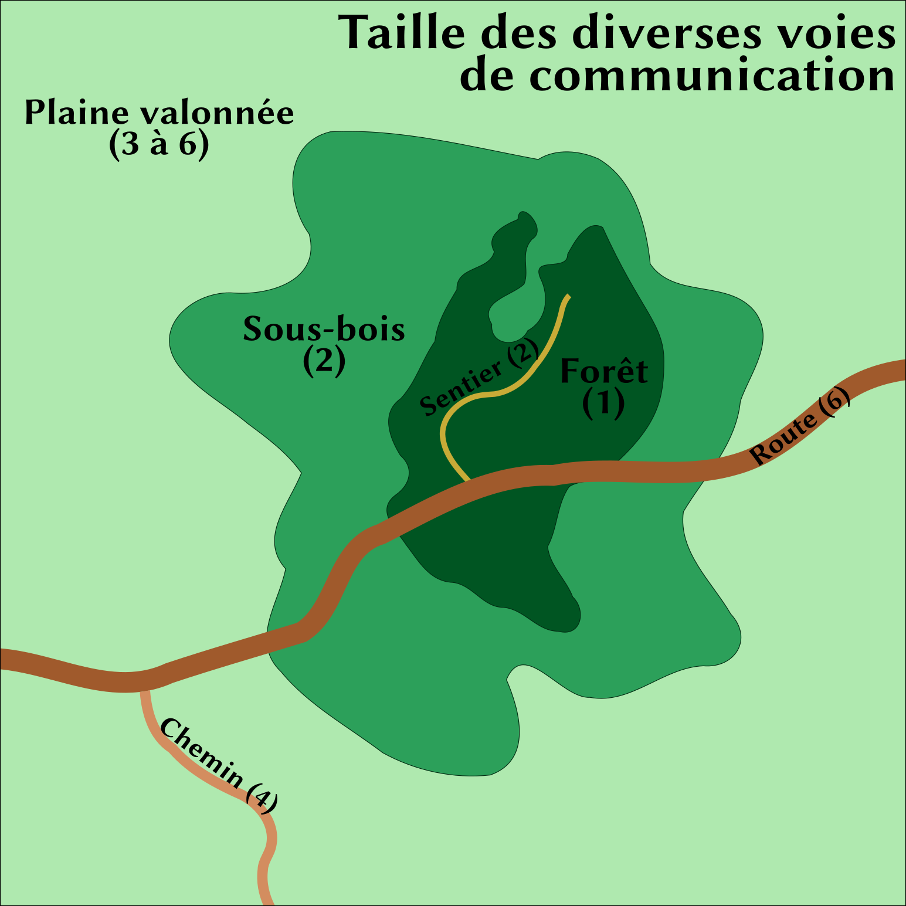

.. raw:: latex

    \clearpage
    \pagebreak

##################
Règles spécifiques
##################

Poursuites de véhicules
=======================

.. class:: center 

 .. class:: red

  **Tout le monde a vu au cinéma une poursuite de voitures, de camions, de
  vaisseaux spatiaux... On s'engouffre entre deux astéroïdes, on prend une
  ruelle à contresens..., Et pendant ce temps-là les mitraillettes crépitent,
  les lasers fusent, le blindage s'étiole... Si vous désirez jouer de telles
  poursuites, les règles qui suivent sont là pour ça. Elles sont divisées en
  deux sections, une pour gérer très rapidement une poursuite, l'autre pour
  ceux qui préfèrent les détails. Plus tout ce qu'il faut pour gérer les dégâts
  faits par un obus de canon contre une voiture, un tank ou un vaisseau
  spatial.**

Cours après moi... (règle simple)
---------------------------------

Dans les cas les plus fréquents, la poursuite se jouera entre deux adversaires
de puissance (vitesse et maniabilité) relativement proche. Ce sera le cas entre
deux voitures, entre une moto et une voiture, etc.

Vitesse
^^^^^^^

La première chose à faire est d'estimer la vitesse et la maniabilité
respectives des véhicules en fonction du lieu de la poursuite. Dans une ville,
la moto est bien plus maniable, et peut-être un peu plus rapide que la voiture.
Sur autoroute, la maniabilité est la même, seule la vitesse compte. Cette
différence, vous allez l'estimer par un bonus (de +1 à +3) que vous donnerez au
véhicule le plus avantagé.

Distance
^^^^^^^^

Ensuite vous estimerez la distance à laquelle sont les deux véhicules.
(Aidez-vous du tableau des distances.) Elle va de 0 (contact) à 14 (très loin).
Il peut arriver, quand vous êtes en ville par exemple, ou derrière un
astéroïde, que la poursuite commence relativement près.

.. table::
  :align: center
  :widths: auto

  +----------+-----------------+
  | Distance | Modificateur au |
  |          | Test de Tir     |
  +==========+=================+
  |    0     |  +4             | 
  +----------+-----------------+
  |    1     |  +2             |
  +----------+-----------------+
  |    2     |  +1             |
  +----------+-----------------+
  |    3     |   0             |
  +----------+-----------------+
  |    4     |  -1             |
  +----------+-----------------+
  |    5     |  -2             |
  +----------+-----------------+
  |    6     |  -4             |
  +----------+-----------------+
  |    7     |  -4 ou          |
  +----------+  impossible     +
  |    8     |  suivant l'arme |
  +----------+                 +
  |    9     |                 |
  +----------+                 +
  |    10    |                 |
  +----------+                 +
  |    11    |                 |
  +----------+                 +
  |    12    |                 |
  +----------+                 +
  | et plus  |                 |
  +----------+-----------------+

Poursuite
^^^^^^^^^

Il ne reste plus qu'à demander un **test** de pilotage aux deux conducteurs des
véhicules. Ce test est à renouveler à un rythme qui dépend du type de
poursuite. Cela peut être toutes les minutes pour deux voitures, ou toutes les
heures pour deux bateaux à voile.

La valeur du **test** est Corps |corps| (ou Esprit |esprit| ou Instincts
|instinct|) + Perception |perception| + Mécanique |mecanique| + talent de
pilotage + bonus de vitesse. La Composante est Corps |corps| quand il s'agit de
conduire un véhicule où la commande réagit directement aux mouvements des pieds
ou des mains du conducteur. C'est Esprit |esprit| quand il faut calculer un
cap, une trajectoire, et que c'est ensuite à l'engin de réagir. Dans quelques
cas très particuliers (éviter au dernier moment une embûche) on fera le test
avec Instincts |instinct|.

Il ne s'agit pas d'un véritable duel. Chaque adversaire qui réussit son
**test** rattrape (ou s'éloigne) de [C] unités de distance. Si l'un des deux
rate son **test**, il ne « recule » pas, il avance tout simplement à sa vitesse
moyenne. Sauf en cas d'échec critique bien sûr.

 .. class:: darkred

  *Exemple :* Jacques Ducoeur à bord de sa Porshe poursuit Aknis Devreaux sur
  sa Honda 250. Comme ils sont en ville, dans une circulation moyennement
  dense, Aknis a un bonus de +1. Ducoeur vient d'apercevoir Devreaux à l'angle
  de la rue. La distance est de 6. Aknis doit réussir un **test** de 9 (le
  bonus est compris) et Jacques de 9 (il est meilleur pilote). Aknis obtient 6,
  c'est une MR de 3, il lance 2d6 et obtient 10, donc sur la table, à la rangée
  [C] il lit qu'il avance de 1 unité. Jacques fait 8, c'est une MR de 1, il
  lance 2d6 et obtient 7, il avance aussi de 1 unité. Une minute plus tard, ils
  recommencent. Aknis fait 9 : un échec. Il suit normalement le flot de la
  circulation. Jacques fait 5, une MR de 4 à laquelle il rajoute 2d6 (résultat:
  8) soit 12 et avance de 2 unités. La distance qui les sépare est passée de 6
  à 4 unités.

Tirer
^^^^^

Comme vous l'avez vu sur le tableau, on peut essayer de tirer sur son
adversaire. Auquel cas, en fonction de la distance, il faut rajouter un malus
ou un bonus à son test de tir.

Manoeuvre
^^^^^^^^^

On peut également essayer de manoeuvrer, de prendre des risques. Pour cela, on
décrit une manoeuvre au meneur de jeu et aux autres joueurs. Il faut que tout
le monde imagine bien la scène. Cette manoeuvre, vous allez l'estimer avec une
**difficulté**, qui ira de -6 à -1. C'est cette **difficulté** que vous allez
ajouter à votre **test** normal de poursuite. Les conséquences sont simples :

:test réussi: vous rajoutez le double de la valeur de la manoeuvre à votre
               marge de réussite (+6 à votre MR pour une difficulté de -3).
:test raté: vous vous éloignez réellement de votre adversaire (ou il se
             rapproche si c'est lui qui vous poursuit) d'une distance de [c]
             unités, en prenant cette fois la marge d'échec pour l'évaluer.

... Que je t'attrape (règle plus complexe)
------------------------------------------

:label:`regles-deplacements-avancees`

Il s'agit de reprendre pratiquement tous les points de la règle précédente, en
les précisant à chaque fois, et en rajoutant quelques données.

Vitesse maximale
^^^^^^^^^^^^^^^^

Cette fois la vitesse n'est plus la même pour tout le monde. Vous devrez, dans
l'univers dans lequel vous faites jouer, définir, pour une même classe de
véhicules, quel est le plus lent et quel est le plus rapide. Attribuez la
valeur [c] au plus lent, la valeur [J] au plus rapide. Vous pourrez ainsi
estimer la valeur d'un véhicule entre ces deux bornes.

 .. class:: darkred

  *Exemple :* Sur une route moderne, on va de la mobylette [c] à la Ferrari
  [J]. On aura ainsi des camions [E], des petites motos [F], etc. On ne tient
  pas compte des vélos (trop lents pour cette catégorie) pas plus que des
  voitures de course.

Taille & maniabilité
^^^^^^^^^^^^^^^^^^^^

Il faut définir la taille et la maniabilité de votre véhicule. La plus petite
taille (la valeur 1) sera réservée à l'espace le plus petit dans lequel peut
passer un véhicule (pour les véhicules normaux, ce sera un chemin vicinal ou
une petite ruelle). La plus grande taille sera celle des véhicules les plus
gros (plus de 8).

Pour chaque véhicule on indique sa taille et sa maniabilité par la formule
**t(m)**. La taille du véhicule est **t**, **m** sa maniabilité, c'est-à-dire
l'espace minimum dans lequel il peut manoeuvrer.

 .. class:: darkred

  *Exemple :* une mobylette **1(1)** passe partout alors qu'un semi-remorque
  **6(3)** ne passe pas dans les ruelles **(1)** ni dans les petites rues
  **(2)**, mais circule dans les rues normales, et n'est à l'aise que sur les
  autoroutes **(6)**.

On note au final la **taille t**, la **maniabilité m** et la **vitesse v** par
la formule **t(m) [v]**.

Vitesse actualisée
^^^^^^^^^^^^^^^^^^

.. raw:: latex

    \begin{figure*}
    \begin{minipage}{\textwidth}

.. image:: images/vitesses.pdf
    :width: 12cm
    :align: center

.. raw:: latex

    \end{minipage}
    \end{figure*}

La vitesse réelle du véhicule n'est plus la vitesse maximale, elle est modifiée
par le terrain dans lequel les véhicules évoluent. La règle est la suivante :
on diminue d'une colonne la vitesse d'un véhicule, par unité de différence
entre sa taille et celle de la voie qu'il emprunte. Un véhicule ne peut
circuler sur une voie inférieure à sa maniabilité.

 .. class:: darkred

  *Exemple :* Un sloop à fond plat **3(2) [D]** est poursuivi par une frégate
  **7(4) [H]**. En pleine mer (**taille 10**), la frégate va vraiment plus vite
  que le sloop (**[H]** contre **[D]**), par contre, entre des petites îles, la
  taille de la voie devient **5**. Comme la frégate a une taille de **7**, on
  diminue sa vitesse de 2 colonnes, elle passe à **[F]**. Si le sloop allait
  sur des hauts-fonds (**taille 2**), il passerait tout juste et serait gêné,
  mais la frégate ne pourrait le suivre.

Croisière
^^^^^^^^^

Lorsque deux véhicules sont très loin l'un de l'autre (distance supérieure à 16
unités), on ne fait pas de test de pilotage, on regarde simplement de combien
d'unités chaque véhicule avance. Trois régimes sont possibles : économique,
croisière, sur-régime.

Pour cela on lit la table des dégâts. En colonne, on prend donc la vitesse
actuelle du véhicule. Puis on lit la ligne correspondant à la vitesse choisie :

:Vitesse économique: Ligne **7 8 9**, la première des lignes bleues, indiquée à
                     droite par un signe **-**. On va moins vite, mais on
                     économise le carburant.
:Vitesse de croisière: Ligne **10 11**, indiquée par un signe **=** à droite.
                       C'est la vitesse normale.
:Sur-régime: Ligne **12 13 14**, indiquée par un signe **+** à droite. On va
             plus vite, mais on consomme plus et on risque de casser la
             machine.

Poursuite
^^^^^^^^^

Les **tests** de poursuite se font comme dans les règles simples, y compris les
prises de risques avec les manoeuvres.

Le **test** est Corps |corps| (ou Esprit |esprit| ou Instincts |instinct|) +
Perception |perception| + Mécanique |mecanique| + talent de pilotage. La seule
différence est que les unités de distance ne se calculent plus avec [C] à
chaque fois, mais avec la vitesse de chaque véhicule, et qu'il n'y a donc plus
de bonus de vitesse.

Les différents types de terrain
^^^^^^^^^^^^^^^^^^^^^^^^^^^^^^^

Suivant la nature du terrain où se déroule la poursuite, un facteur de
maniabilité est donné. Il va de 1 (forêt dense) à 10 (désert plat de pierre
dure). Le petit schéma ci-dessous vous fournira les valeurs les plus courantes.
S’il s’agit de poursuite en vol, la maniabilité dépend de la taille de la zone
où l’on vole : de 1 (taille d’un aigle) à 10 (ciel ouvert). Des conditions
météo défavorables peuvent également diminuer la maniabilité (par exemple, une
tempête peut être considérée comme empêchant de voler les créatures de
maniabilité inférieure à 6).

Animal monté
^^^^^^^^^^^^

Lorsqu’il s’agit d’une poursuite entre animaux seuls, chacun fait son **test**
de course, avec la possibilité d’utiliser ses points d’Energie. Par contre, si
l’animal est monté, le **test** se fait avec sa valeur mais en ajoutant le
score d’Equitation de cavalier. Les points d’Energie sont alors toujours ceux
de l’animal, mais le cavalier ne peut les faire utiliser à sa monture que s’il
a un score de +1 ou supérieur au **talent** d’Equitation.

Autres « véhicules »
^^^^^^^^^^^^^^^^^^^^

A titre de comparaison, on pourra utiliser les valeurs de déplacement suivantes
(pour les poursuites bien sûr) :

:Un homme: 1(1)[B]. **Test** de course : Corps |corps| + Action |action| +
           Humain |humain| + Athlétisme.
:Un char de course (deux ou quatre chevaux): 4(3)[E]. **Test** de course : 9. 
           Le fait d’avoir deux ou quatre chevaux ne modifie pas la vitesse
           mais l’endurance de l’attelage.

.. table::
  :align: center
  :widths: auto
 
  ================= =========== =======
  Exemples          Dplct.      Test
  ================= =========== =======
  Humain            1 (1) [B]   |ldash|
  Loup Géant        2 (1) [C]   8 à 9
  Cheval            3 (1) [E]   9 à 11
  Attelage          4 (3) [E]   9
  Guépard           1 (1) [G]   13            
  Aigle géant       3 (3) [G]   10
  Dragon adulte     8 (4) [I]   12
  ================= =========== =======

Travaux pratiques
-----------------

Enomias l’elfe monte un cheval de course (1)[E] avec une valeur de course de
10. Enomias a +1 en Equitation (donc une valeur de **test** total de 11). Au
détour d’un grand chemin, il aperçoit au loin (distance 12) un orque monté sur
un loup géant, à quelque distance d’un bois (distance 2). À sa vue, l’orque
s’enfuit et Enomias décide de le poursuivre. Le loup a un déplacement de
2(1)[C], une valeur de course de 9, et l’orque a +1 en Chevaucher un loup
(valeur de **test** totale de 10).

Passe d’arme 1
^^^^^^^^^^^^^^

Enomias obtient 6 au jet de dés, c’est donc une réussite de 5, plus 2d6 (il
fait 8) : la distance parcourue est de 3 cases (colonne[E]). L’orque fait 6,
réussit de 4, plus 2d6 (7) : la distance parcourue est de 1 case (colonne[C]).
La distance entre les deux poursuivants a donc diminué de 2 (elle passe à 10)
et l’orque n’est plus qu’à une case du bois.

Passe d’arme 2
^^^^^^^^^^^^^^

Enomias obtient 9, réussite de 2, plus 2d6 (5), soit une distance de 2 cases.
L’orque prend peur et décide de faire bondir son loup (il le force à dépenser
1pt de Puissance |puissance|), ce qui lui ajoute 1 au **test**. Il fait bien car le jet de
dés donne 10, réussite de 1, plus 2d6 (8) : déplacement de 1 case, le loup et
l’orque sont à l’orée du bois. La distance entre les deux poursuivants est
passée à 9.

Passe d’arme 3 et suivantes
^^^^^^^^^^^^^^^^^^^^^^^^^^^

Le meneur de jeu peut décider que l’elfe ne s’est pas suffisamment rapproché de
l’orque pour la suivre dans les sous-bois. Il peut aussi décider que la
poursuite continue. Auquel cas le loup n’est pas gêné par les sous-bois (il a
une taille de 2 seulement). Mais si Enomias s’y engage, son cheval n’aura plus
qu’une vitesse de [D], le malus d’une colonne étant dû au fait que sa taille
est de 3, et que les sous-bois ont une taille de 2.

Si les poursuivants s’enfoncent dans la forêt (taille 1), le loup ne se
déplacera plus que de [B] et le cheval de [C].

Bref, tous les cas de figure montrent que l’orque a toutes ses chances de se
faire rattraper. Sa seule chance est de rentrer suffisamment vite dans les
bois, ou la visibilité est moins grande, et de tendre une embuscade à l’elfe
(ou tenter de se cacher).

Des objets magiques
-------------------

:Licol d’obéissance: Une fois passé au cou d’un cheval, l’animal obéit et court
                        avec son cavalier comme si celui-ci avait un **talent**
                        d’Equitation à 0. il existe le même genre de harnais
                        pour les loups géants et les aigles, mais pas pour les
                        dragons.
:Bague de course: Le porteur de la bague dépense 1EP et peut courir pendant une
                  heure avec le facteur de déplacement 1(1)[D].
:Potion de vol: Celui qui boit la potion vole pendant une heure avec le facteur
                vol 1(1)[C].

----

.. raw:: latex

    \clearpage
    \pagebreak

Dégâts et Blindages
===================

.. class:: center

 .. class:: red

  **On se rend bien compte, quand on tape sur un mur avec ses poings, qu'on ne
  lui fait pas grand mal (en ce qui concerne vos mains, c'est une autre
  affaire).  D'où l'idée de classes de blindage, pour gérer aussi bien des
  humains que des voitures, des blindés ou des engins spatiaux.**

Classes de blindage
-------------------

Ces classes vont de A à L, et les dégâts que l'on inflige à des structures
solides ne sont plus des points de vie, mais des points de choc (PC). Les PC de
classe B sont deux fois plus résistants que ceux de classe A |s| ; ceux de
classe C sont deux fois plus résistants que ceux de classe B, et donc quatre
fois plus que ceux de classe A |s| ; etc. Le tout est résumé dans le tableau
ci-dessous.

.. table::
  :align: center
  :widths: auto

  =======  ========
  Classe   Valeur
  =======  ========
    A       1
    B       2
    C       4
    D       8
    E       16
    F       32
    G       64
    H       128
    I       256
    J       512
    K       1024
    L       2048
  =======  ========

On notera une maison qui a 10 points de choc de classe A par 10 PC\ :supt:`A`.
Le nombre de PC d'un objet peut varier de 5 à 10 (objet normal) à 100 ou 1000
(gigantesques artefacts).

Liste des classes de blindage
^^^^^^^^^^^^^^^^^^^^^^^^^^^^^

:Classe A: Humains et créatures vivantes
:Classe B: Objets normaux (chaise)
:Classe C: Objets solides (porte)
:Classe D: Bâtisses
:Classe E: Engins blindés (tank)
:Classe F: Surblindage (vaisseaux spatiaux)
:Classe G: Duraminium / diamant
:Classe H: Boucliers énergétiques de puissance
:Classe I: Méga bouclier
:Classe J: Ultra bouclier
:Classe K: Manteau planétaire solide
:Classe L: Bouclier de type « inconnu»

Classes d'arme
--------------

De la même manière que l'on distingue les protections plus élevées que la
normale, on distinguera les armes plus puissantes également par leur classe,
qui varie aussi de A à L, et qui est équivalente (une arme de classe B est
prévue pour détruire les blindages de classe B).

Par contre, alors que les armes normales (qui sont en fait les armes de classe
A) ont des caractéristiques variant de [A] à [J], les armes de classe B et
supérieures n'ont pas autant de différences. A priori, toutes les armes de
classe C se valent, et ainsi de suite. On notera donc un canon laser\ :supt:`A`, ou un
mégablaster\ :supt:`D`, etc.

Liste des classes d'arme
^^^^^^^^^^^^^^^^^^^^^^^^

:Classe A: Arme blanche, mitrailleuse
:Classe B: Canon (petit calibre)
:Classe C: Canon moyen calibre)
:Classe D: Canon (gros calibre)
:Classe E: Batterie d'artillerie
:Classe F: Canon blaster
:Classe G: Missile laser
:Classe H: Laser de haute puissance
:Classe I: Méga blaster (Bombe A)
:Classe J: Ultra blaster (Bombe H)
:Classe K: Méta bombe
:Classe L: Armageddon

Résolution des attaques
-----------------------

Quand on se bat avec des armes de haute technologie, on est généralement à
distance et on fait le **test** normal de combat à distance. Vous pouvez aussi
avoir des armes de contact de classe C ou D, mais rarement supérieures. II n'y
a pas de règle d'armure (toucher ou protection). Si on a touché, on consulte la
grande table ci-dessous après avoir calculé normalement la somme MR +2d6. Et on
lit, en fonction de la classe de l'arme (elle est toujours dans la colonne Arme
X) et de la classe du blindage (inférieure ou supérieure), si on fait des PC,
et combien.

.. raw:: latex

    \begin{figure*}
    \begin{minipage}{\textwidth}

.. image:: images/resolution_attaques_blindage.pdf
    :width: 16cm
    :align: center

.. raw:: latex

    \end{minipage}
    \end{figure*}

\

 .. class:: darkred

  *Exemple :* Bruce Wilfor tire avec un missile laser\ :supt:`G`, sur un
  vaisseau dont les boucliers énergétiques sont de 40 PC\ :supt:`H`. Le
  résultat final du jet de dégâts est 21, ce qui donnerait 8 si la protection
  était de classe G. Mais elle est de classe H, on lit donc le résultat en
  décalant d'une colonne sur la droite : on ne retire que 4 PCH au vaisseau. À
  l'inverse, sur un immeuble de 100 PC\ :supt:`D`, Wilfor aurait infligé 64 PC\
  :supt:`D`, le détruisant à moitié.

----

.. raw:: latex

    \clearpage
    \pagebreak

Le bon, le méchant et le druide
===============================

.. class:: center 

 .. class:: red

  **La décomposition de la magie, ou des pouvoirs « spéciaux », en listes
  d’énergies diverses permet une grande variété, mais comporte un petit
  inconvénient. Soit on devient un technicien de la magie (magie hermétique),
  et on peut presque tout faire, soit on se spécialise, mais alors les
  possibilités se restreignent. Les « prêtres », eux, ont l’avantage d’avoir
  des sorts de magies diverses puisque « donnés » par leurs dieux.**

  **Pour compenser, nous vous proposons trois nouvelles Energies, qui ont
  l’avantage d’être à mi-chemin entre la « magie » et la « religion ». Elles
  s’utilisent sans tests à faire, juste en dépensant des PS ou EP (d’une
  manière proche des règles simples de magie, page** :pageref:`magie-simple`\
  **).  Leurs noms sont très simples : Bien, Nature et Mal.**

Utilisation des trois Énergies
------------------------------

Chaque Énergie engendre des « pouvoirs » de niveau 0, 1, 2 ou 3. Pour utiliser
un pouvoir, il faut dépenser autant de EP que le niveau du pouvoir, et avoir le
niveau requis dans l’Énergie correspondante. On peut dépenser 2PS au lieu d’1EP.

 .. class:: darkred
  
  *Exemple :* Pour lancer un pouvoir du **Bien** de niveau 2, il faut avoir au
  moins 2 dans l’Énergie du **Bien**, et dépenser 2 EP (ou 1 EP et 2PS |s| ; ou
  4PS, mais on risque de s’évanouir).

Pour les pouvoirs de niveau 0, on dépense 1PS mais il faut quand même avoir
l’Énergie correspondante au niveau 1. On ne peut pas utiliser de focus. Ces
pouvoirs sont de nature magique, et la cible peut toujours y résister. Elle
fait alors un duel de résistance à la magie (valeur de 6 par défaut. Exceptions
: voir p. :pageref:`resistancemagique`). La marge de réussite de l’utilisateur
du pouvoir est de 1d6/2 (comme pour la Magie Simple, on arrondit au supérieur).

Utilisation des autres Energies de base
---------------------------------------

- Par point de Précision |precision| ou de Puissance |puissance| : on rajoute
  1d6 par point investi au calcul de la marge de réussite (on divise le total
  des dés, y compris celui initial, par deux et on arrondit à l'entier
  supérieur).
- Par point de Rapidité |rapidite| : on fait faire à l’adversaire autant de
  **tests** supplémentaires de résistance à la magie que de points investis en
  Rapidité.  Et on choisit le **test** le plus favorable.

Distance
--------

Tous les pouvoirs sont valables, soit au toucher, soit à une distance de 6
mètres maximum, la cible devant toujours être visible. Certains pouvoirs
correspondent à des sorts des listes (p.
:pageref:`grimoire-start`-:pageref:`grimoire-end`), auquel cas leur portée peut
effectivement être plus réduite ici.

Temps
-----

Le temps de concentration pour un pouvoir dépend du niveau du pouvoir.

- Niveau 0 : 1 passe d’armes
- Niveau 1 : 1 minute
- Niveau 2 : 10 minutes
- Niveau 3 : 1 heure

Incompatibilité
---------------

On ne peut jamais avoir en même temps des points en Énergie du **Bien** et du
**Mal**.  Si on a des points dans l’une de ces Énergies et que l’on souhaite en
avoir dans celle opposée, on perd aussitôt tous les points de la première. On
peut par contre avoir à la fois des points dans l’Energie **Nature** et dans
une des deux autres.

Apprendre les pouvoirs
----------------------

Apprendre un pouvoir de niveau 0 coûte 1PA |s| ; de niveau 1 : 3PA |s| ; de
niveau 2 : 6PA |s| ; de niveau 3 : 9PA.

Quand on atteint un nouveau niveau en Energie, on a droit gratuitement à un
pouvoir de niveau inférieur ou égal au niveau atteint, au choix du joueur.

Le Bien
-------

Restrictions
^^^^^^^^^^^^

Il faut avoir au moins 1 point dans le Règne que l’on veut prendre pour cible.
Il n’est donc pas possible de soigner un humain si on n’a pas au moins 1 en
Règne Humain.

Niveau 0
^^^^^^^^

:Apaisement: Calme la cible pendant MR minutes.
:Détection du Mal: Détecte si la cible est de nature mauvaise (type démon), si
                    elle pratique la magie noire, ou si elle est coupable de
                    crimes ayant entraîné la mort (directement ou
                    indirectement).

Niveau 1
^^^^^^^^

:Détection des mensonges: Si la cible ment, et pendant les MR minutes
                           suivantes, sa voix devient très stridente
                           (uniquement à vos oreilles).
:Guérison des blessures: Redonne 1PV à la cible.
:Protection contre le Mal: Toute créature maléfique (démon, mort-vivant ou
                            assimilé) a un malus de 2 à tous ses **tests** contre
                            la cible, pour MR heures.
:Purifier eau et nourriture: (|mineral| et/ou |vegetal| et/ou |animal|) Purifie
                             de quoi nourrir MRx4 personnes.
:Renvoi de sort: On renvoie vers son adversaire un sort de magie noire dont on
                 est la cible. Le temps de concentration est quasi instantané,
                 il n’y a pas de Règne nécessaire minimum.

Niveau 2
^^^^^^^^

:Bénédiction: Le prochain **test** de la cible (autre que l’utilisateur du
                pouvoir) aura un bonus de +2, sauf s’il s’agit d’un acte
                mauvais.
:Catalepsie: Plonge une cible mortellement blessée en catalepsie, pendant MR x
             4 heures, durant lesquelles son état restera stationnaire.
:Guérison des maladies: Guérit une maladie.
:Remords: La cible, si elle a commis un crime ou un vol, subit -1 à tous ses
          **tests**, jusqu’à ce qu’elle ait réparé ses torts, ou se soit
          sincèrement repentie si ce n’est pas possible.

Niveau 3
^^^^^^^^

:Accroissement des récoltes: (ou de la fertilité) Sur un couple humain, animal
                              ou un champ.
:Désenvoûtement: Dissipe tous les envoûtements ou possessions démoniaques d’une
                 cible.
:Exorcisme: (pas de Règne nécessaire) Renvoie un démon aux enfers, détruit un
            mort-vivant, etc. (Attention, ils ont droit à leur résistance
            magique).
:Guérison: La cible regagne tous ses PV et PS, mais aucun EP.

La Nature
---------

Restrictions
^^^^^^^^^^^^

Il faut avoir au moins 2 points dans le règne que l’on veut cibler (qui ne peut
jamais être Mécanique |mecanique|, sauf Inaction. Voir plus loin). Certains
pouvoirs ne peuvent être utilisés qu’avec les Règnes Animal |animal| et Végétal
|vegetal| et pas Humain |humain| D’autres pouvoirs sont du Règne Minéral
|mineral|, même s’ils ont pour cible des humains, animaux ou végétaux. Le Règne
nécessaire est indiqué entre parenthèses quand il n’est pas évident.

Niveau 0
^^^^^^^^

:Connaître le temps: (|mineral|) On sait le temps qu’il fera au cours des MR
                      prochaines journées.
:Indifférence animale: Pendant MR heures, les animaux ne vous craignent plus,
                        ou ne vous veulent plus de mal. Si on utilise ce
                        pouvoir pour nuire à un animal, ce pouvoir disparaît
                        ensuite à tout jamais.
:Main verte: Une plante sur le point de mourir, à cause de mauvais soins,
             retrouve santé si on lui donne de quoi se « soigner » (terre,
             eau).

Niveau 1
^^^^^^^^

:Amitié animale: L’animal ciblé s’approche de vous, se laisse caresser, monter,
                  pendant MR heures. Il aura ensuite un a priori favorable à
                  votre égard.
:Croissance optimale: (non |humain|) L’animal, le fruit, la plante ciblée aura
                      pendant les MR mois qui suivent une croissance optimale.
                      C’est-à-dire qu’elle restera naturelle, dans les normes,
                      mais au mieux de ce qui est possible.
:Protection: (|mineral|) La cible est immunisée pendant MR x 4heures à la
             chaleur, au froid, à la faim, la soif, ou tout autre « désagrément
             » naturel.

Niveau 2
^^^^^^^^

:Camouflage: (|mineral| et/ou |vegetal|) La cible est quasiment invisible
             pendant MR minutes.
:Changer le temps: (|mineral|) Change la tendance du temps (plutôt beau,
                   pluvieux ou nuageux) de la journée à venir dans les
                   environs.
:Guérison d’un poison naturel: (en fonction du Règne d’origine du poison) Les
                                  effets d’un poison naturel sont annulés (cas
                                  particulier : le temps de concentration est
                                  de 4 passes d’armes seulement).
:Insensibilité: (|mineral|) L’utilisateur du pouvoir est insensible aux flammes
                 et à l’électricité pendant MR heures. Temps durant lequel il
                 n’a pas besoin non plus de respirer, manger, dormir ou boire.
:Passage sans traces: (|mineral| et/ou |vegetal|) L’utilisateur du pouvoir
                      marche sans laisser de traces pendant MR heures.
:Silence: (|mineral|) Plus aucun bruit n’est émis dans une zone de 3 mètres
          autour de l’utilisateur du pouvoir, pendant MR minutes.

Niveau 3
^^^^^^^^

:Inaction: Empêche un engin mécanique (catapulte, moulin, arme à feu,
           ordinateur, etc.) de fonctionner pendant MR jours. Pour utiliser ce
           pouvoir, il faut avoir un Règne Mécanique |mecanique| égal à 0.
:Langage animal: (|animal|) On comprend et on se fait comprendre des animaux
                 pendant MR heures.
:Passe-muraille: (|mineral|) L’utilisateur du pouvoir peut passer à travers MR
                 mètres de matière minérale.
:Transformation: (non |humain|) L’utilisateur du pouvoir peut se transformer,
                 pendant MR heures, en un minéral, un animal ou un végétal dont
                 il a le modèle à portée de vue, et qui est de masse à peu près
                 comparable à celle d’un homme

Le Mal
------

Restrictions
^^^^^^^^^^^^

Il faut avoir au moins 1 point dans le Règne que l’on veut prendre pour cible.
Si on utilise la magie noire, chaque utilisation de ces pouvoirs rapporte
autant de points de magie noire que le niveau du pouvoir (et 1 pour les
pouvoirs de niveau 0).

Niveau 0
^^^^^^^^

:Détection du Bien: Ne détecte que les personnes qui irradient de l’Énergie du
                     Bien : les saints ou les créatures surnaturelles dont la
                     nature est profondément bonne.
:Malchance: La cible a-1 à son prochain **test** de résistance (vis-à-vis de
            tout).

Niveau 1
^^^^^^^^

:Aggravation des blessures: La prochaine blessure subie par la cible (avant MR
                            heures) sera aggravée de 1PV (pouvoir non cumulable
                            sur la même cible).
:Invisibilité aux êtres démoniaques: (|humain|) L’utilisateur du pouvoir est
                                        invisible aux êtres maléfiques (démon,
                                        mort-vivant ou assimilé) pendant MR
                                        minutes.
:Mauvais œil: La cible a -1 à ses prochains **tests** pendant MR heures.
:Peur: La cible a peur pendant MR minutes.

Niveau 2
^^^^^^^^

:Aggravation naturelle: Augmente la force d’un orage, du brouillard, d’un
                        tremblement de terre, d’une inondation (de toute
                        perturbation naturelle locale).
:Envoûtement: La cible (que l’on doit toucher) est malade pendant MR semaines.
              Elle a -1 à tous ses **tests** courants.
:Suggestion: Implante une idée fixe, pendant MR jours, à la victime.

Niveau 3
^^^^^^^^

:Affaiblissement: La cible, que l’on doit toucher, perd tous ses PV et PS
                  actuels, sauf 1 de chaque.
:Aspiration de vie: La créature touchée perd 1PV, que vous gagnez. S’il ne vous
                    manque pas de PV, vous gagnez 1PS.
:Croissance impie: La cible animale |animal| grossit anormalement (jusqu’à
                   taille humaine), son venin est amplifié si elle en a un, son
                   agressivité est augmentée. Le pouvoir dure MR heures.

----

.. raw:: latex

    \clearpage
    \pagebreak

Les pouvoirs psioniques
=======================

.. class:: center 

 .. class:: red

    **Tout le monde aimerait pouvoir lire les pensées, voir l’avenir, imposer
    les mains, faire bouger les objets, etc. Ces pouvoirs de l’esprit, auxquels
    certains croient dur comme fer, et qui laissent sceptiques les autres, sont
    regroupés sous l’appellation parapsychologie, ou pouvoirs psioniques. Les
    règles suivantes permettent de mettre dans vos aventures des personnages
    (joueurs ou incarnés par le meneur de jeu) possédant ces pouvoirs. Par
    souci de simplicité, et pour reprendre la terminologie employée en
    science-fiction, nous les appellerons pouvoirs psis.**

Des pouvoirs pour qui ?
-----------------------

La possibilité d’avoir des pouvoirs psis varie en fonction de l’univers dans
lequel les personnages évoluent. C’est dans les mondes de science-fiction
qu’elle est la plus répandue, elle est rare dans les univers contemporains, et
encore plus rare en médiéval-fantastique (où l’on utilise déjà la magie pour
générer l’aspect « merveilleux » du monde).

De plus, même si les pouvoirs psis existent, leur fréquence d’apparition et
leur puissance peuvent être sujettes à variation. Vous pouvez décider que seul
un personnage sur un million a la capacité de lire les pensées, ou bien qu’il
existe une planète sur laquelle 10% de la population pratique la lévitation. Il
est de toute façon déconseillé d’utiliser les pouvoirs psis lors de vos
premières aventures. Une fois que vous saurez bien comment fonctionne le
système de *Simulacres*, essayez ces règles, d’abord avec un PMJ, puis avec un
des joueurs. Si vous trouvez, après un ou deux essais, que ces pouvoirs
modifient trop votre univers, abandonnez cette règle.

Talents et Énergie psioniques
-----------------------------

Tout pouvoir psionique est considéré comme un nouveau **talent**, que l’on
acquiert à la création du personnage ou avec des points d’aventure. Il existe
une nouvelle Énergie, l’**Énergie psionique**, qui sert à déclencher les
pouvoirs et à indiquer leur puissance (un peu comme la magie). Lors de la
création du personnage, on ne peut mettre que 1 point dans cette Énergie (son
maximum est de 3), point que l’on doit prendre dans le total des 8 points
disponibles pour l’ensemble des Règnes et des Énergies. Certains pouvoirs psis
augmentent en puissance et capacité avec l’Énergie psionique que l’on peut y
insuffler, tandis que d’autres ne sont accessibles qu’à partir d’une certaine
valeur en Énergie psionique.

Fonctionnement des pouvoirs psis
--------------------------------

Tous les pouvoirs psis fonctionnent si on réussit un **test** de Composante
(presque toujours Esprit |esprit|) + Moyen + Règne + Pouvoir psi +
**difficulté**. Le **test** exact est donné un peu plus loin pour chaque
pouvoir psi |s| ; la **difficulté** variant en fonction d’une règle spéciale
(voir plus bas). On doit également dépenser autant de points d’équilibre
psychique (EP) que le niveau d’Énergie psionique requis par le pouvoir (et donc
posséder un score suffisant dans cette Énergie).

Si le pouvoir fonctionne, la victime a parfois droit à un **test** de
résistance (c’est précisé dans chaque cas). Enfin, l’effet du pouvoir est géré
en fonction de la marge de réussite (MR).

Progression et difficulté
-------------------------

Un **talent** psionique ne progresse pas avec les points d’aventure comme les
autres **talents**.

- Avec les règles de base: la **difficulté** est de -4. À chaque **test** où on fait un
  double-|1|, la **difficulté** diminue de +1, jusqu’à un maximum possible de +3.

- Avec les règles de campagne: il n’y a pas de **difficulté**, mais on met au
  départ le **talent** au niveau -4 (ce qui revient au même). À chaque **test**
  du pouvoir où l’on fait un double-|1|, le niveau augmente de 1, jusqu’à un
  maximum possible de +3. Les règles sur les succès critiques s’appliquent,
  mais la progression se fait seulement avec un double-|1|, et non pas avec une
  réussite critique.
- Une fois que le personnage est au niveau +3, il est bloqué dans sa
  progression. Sauf si vous utilisez les règles de super-héros (page
  :pageref:`les-super-heros`). Auquel cas, au prochain double-|1|, le pouvoir
  psionique se transforme en pouvoir de super-héros. Et s’utilise dorénavant
  suivant les règles spécifiques à ce cas.

Énergies et échec critique
--------------------------

On peut utiliser les Énergies normales de la même manière que dans les règles
de base et optionnelles (pour augmenter ses chances de réussite ou ses effets),
que ce soit avec des points de souffle ou d’équilibre psychique. Mais n’oubliez
pas que le pouvoir psi ne se déclenche, lui, qu’avec des points d’équilibre
psychique.

- Si le personnage fait un double-|6| lors d’un test de pouvoir psionique, il
  perd autant de EP qu’il avait dépensé en tout de points d’Énergie (y compris
  Puissance |puissance|, Précision |precision| et Rapidité |rapidite|). S’il
  n’en a pas assez, il perd ensuite des points de souffle, puis des points de
  vie (dans le torse si on utilise la règle des points de vie localisés).

Méditation
----------

Parce que les utilisateurs de pouvoirs psis dépensent beaucoup de points
d’équilibre psychique, ils ont développé un nouveau **talent**, qui est une
méthode de méditation.  Elle permet, en se concentrant un long moment, de
récupérer plus vite des EP. Ce **talent** est accessible à tous les possesseurs
de pouvoirs psis. Par contre, dans un monde « normal », seuls des personnages
comme des sages tibétains, des mystiques, peuvent connaître et enseigner cette
méthode.

La **Méditation psi** est donc un **talent** de niveau (X). Le **test** de
méditation se fait sur Esprit |esprit| + Désir |desir| + Humain |humain| +
Méditation psi - EP perdus. Si le **test** réussit on récupère [b] EP au bout
de 18 heures de méditation. Cette méditation doit être profonde et ne pas être
interrompue par aucune activité d’aucune sorte. Pour pouvoir ensuite à nouveau
méditer, il faut s’être reposé au moins 6 heures.

Liste des principaux pouvoirs psis
----------------------------------

Rappelons que le Néant |neant| est un Règne qui regroupe tous les autres, et
qui vaut toujours -1.

----

Télépathie
^^^^^^^^^^

Niveau 1
********

:Connaître les pensées: Test: Esprit |esprit| + Perception |perception| + Humain |humain|. Résistance:
                        Esprit |esprit| + Résistance |resistance| + Humain |humain|. Effet: on lit les
                        pensées d’une personne connue jusqu’à MR kilomètres.
:Envoyer ses pensées: Test: Esprit |esprit| + Action |action| + Humain |humain|. Effet: on envoie
                      ses pensées à une seule personne connue jusqu’à MR
                      kilomètres.

Niveau 2
********

:Sentir le danger: Test: Esprit |esprit| + Perception |perception| + Humain
                   |humain|. Effet: on détecte un danger qui va vous affecter
                   dans MR minutes au maximum, ou dont la source se trouve à MR
                   kilomètres.
:Hypnotiser: Test: Esprit |esprit| + Action |action| + Humain |humain|.
             Résistance: Esprit |esprit| + Résistance |resistance| + Humain
             |humain|. Effet: une personne, que l’on connaît, et qui est à
             moins de MR kilomètres, est sous votre contrôle mental pour MR
             heures.

Niveau 3
********

:Imposer sa volonté: Test: Esprit |esprit| + Désir |desir| + Néant |neant|.
                     Résistance: Esprit |esprit| + Résistance |resistance| +
                     Humain |humain|. Effet: toutes les créatures vivantes,
                     dans une sphère de MR x 1000 kilomètres croient ce que
                     vous voulez leur faire croire (vous prendre pour le
                     messie, vous croire invisible, oublier votre existence,
                     etc.).

----

|s|

Télékinésie
^^^^^^^^^^^

Il y a deux pouvoirs, dont les effets changent avec le niveau.

Niveau 1
********

:Déplacer un objet(1): Test: Esprit |esprit| + Action |action| + Néant |neant|.
                       Effet: on déplace MR kilos de matière à la vitesse d’un
                       homme qui marche, pendant MR minutes.
:Infliger des dégâts(1): Test: Esprit |esprit| + Action |action| + Néant
                           |neant|. Résistance: Corps |corps| + Résistance
                           |resistance| + Humain |humain|. Effet: une créature
                           vivante que vous pouvez voir subit une perte de [a]
                           PV.

Niveau 2
********

:Déplacer un objet(2): Test: idem niveau 1, mais on déplace jusqu’à MR x 100
                        kilos à MR x 10km/h.
:Infliger des dégâts(2): Test: idem niveau 1, mais les dégâts sont de [d] PV.

Niveau 3
********

:Déplacer un objet(3): Test: idem niveau 1, mais on déplace jusqu’à MR x 100
                        tonnes à MR x 100km/h.
:Infliger des dégâts(3): Test: idem niveau 1, mais les dégâts sont de [h] PV.

----

Précognition
^^^^^^^^^^^^

Niveau 1
********

:Voir l’avenir: Test: Esprit |esprit| + Perception |perception| + Néant
                  |neant|. Effet: on a une vision des diverses possibilités
                  d’un avenir qui est au maximum à MR minutes.

Niveau 2
********

:Voir la mort: Test: Esprit |esprit| + Perception |perception| + Humain
               |humain|. Effet: on a une vision des diverses possibilités de
               l’avenir d’une personne, jusqu’à sa mort ou, au maximum, de MR x
               10 années.

Niveau 3
********

:Changer le futur: Test: Esprit |esprit| + Désir |desir| + Néant |neant|.
                   Effet: les prochaines MR heures de votre avenir vont
                   défiler. Jouez normalement, et revenez au début de ce temps
                   si et quand vous le désirez.

----

Guérison
^^^^^^^^

Niveau 1
********

:Guérison: Test: Corps |corps| + Action |action| + (Humain |humain| ou Animal
            |animal|). Effet: vous guérissez une créature de [b] PV et [b] PS
            (répartissez les PV comme vous le désirez).

Niveau 2
********

:Bénédiction: Test: Corps |corps| + Action |action| + Humain |humain|. Effet:
              vous guérissez la maladie (même incurable) d’une personne.

Niveau 3
********

:Résurrection: Test: Esprit |esprit| + Désir |desir| + Néant |neant|. Effet:
               vous ramenez une créature d’entre les morts, pourvu que vous
               ayez son cadavre complet et que le décès ne remonte pas à plus
               de MR jours.

----

.. raw:: latex

    \clearpage
    \pagebreak

Les super-héros
===============

.. class:: center 

 .. class:: red

  **Superman, Flash, Spiderman, Hulk, sont les archétypes des super-héros, ces
  personnages hors normes humaines, qui accomplissent des tâches herculéennes.
  Popularisés par les bandes dessinées américaines, les joueurs de jeu de rôle
  français ont peu l'occasion de les incarner. Alors, puisque vous avez les
  règles de Simulacres entre les mains, pouquoi ne pas essayer ?**

Définition d’un super-pouvoir
-----------------------------

Chaque super-pouvoir dépend d’une Composante et d’un Moyen. Pour savoir si ce
super-pouvoir opère, on lance autant de dés que la valeur de la Composante, et
on compte le nombre de lancers dont la valeur est égale ou inférieure à la
valeur du Moyen. Les Règnes ne sont pas utilisés.

 .. class:: darkred

  *Exemple :* Super Sauterelle (qui a acquis son pouvoir en se faisant mordre
  par une sauterelle radio-active) a le pouvoir de Saut Exceptionnel, qui dé
  pend de son Corps |corps| (qui vaut 5) et de son Action |action| (qui vaut
  3). Pour savoir s’il réussit un saut, il lance 5 dés à six faces (3, 2, 4, 6,
  1) et compte les valeurs inférieures ou égales à 3. Ici il a réussi avec 3
  dés.

Comparaison avec des personnages normaux
----------------------------------------

Si un super-héros affronte un personnage normal (en combat ou dans toute autre
sorte de **duel**) dans le domaine de son pouvoir, il faut calculer les marges
de réussite. Pour le personnage normal, prodédez comme d'habitude. Pour le
super-héros, comptez le nombre de réussites et regardez sur la table ci-dessous.
Vosu vous rendrez compte qu'au-delà de trois réussites, aucun être humain ne
peut concurrencer un super-héros.

.. image:: images/mr_superheros.pdf
   :width: 5cm
   :align: center

Utilisation des Énergies
------------------------

La Puissance |puissance| permet de lancer un dé supplémentaire par point
d’Énergie dépensé. La Précision |precision| augmentent de 1 la valeur à ne pas
dépasser par point dépensé. En cas d'égalité dans un **duel**, c'est le
super-héros qui a mis le plus de Rapidité |rapidite| qui remporte le duel.
Comme d’habitude on dépense 1 PS ou 1 EP par point d’Énergie utilisé.

Valeurs limites
---------------

À part pour des cas plus qu’exceptionnels (demi-dieux ou démons), la valeur
d’une Composante ne peut dépasser 7, et celle d’un Moyen 5 (et en dépensant des
points d'aventure bien entendu).

Réussites et échc critiques
---------------------------

- Si dans le **test** d'un super-héros, tous les dés indiquent |1|, on augmente
  le nombre de réussites de un.
- Si dans le **test** d'un super-héros, tous les dés indiquent |6|, une
  catastrophe d'une ampleur gigantesque arrive au super-héros, en fonction du
  nombre de 6.

   .. class:: darkred

    *Exemple :* Pour deux |6|, il se tord un membre |s| ; pour trois |6|, il se
    casse un bras |s| ; pour cinq |6|, il y a un tremblement de terre |s| ;
    pour sept |6|, une météorite s'écrase sur lui, etc.

Actions usuelles
----------------

En dehors de leurs super-pouvoirs, les super-héros font preque tous leurs
**tests** de façon normale. Une exception : tous les **tests** normaux qui font
agir la Composante utilisée par le pouvoir ont un bonus de +4.

 .. class:: darkred

  *Exemple :* Illusionator, l'homme qui hypnotise les gens, leur faisant croire
  ce qu'il veut, a son pouvoir défini par Esprit |esprit| / Action |action|.
  S'il essaye dans la vie courante de remplir sa feuille d'impôts, il aura un
  bonus de +4 à son **test** normal.

Combats entre super-héros
-------------------------

Chaque super-héros combat avec ses propres pouvoirs (Force contre Force,
Agilité contre Rayons Laser, etc.). C’est un **duel** classique. Celui qui obtient
le plus grand nombre de réussites remporte la passe d’arme. La différence entre
les deux réussites est le nombre de PV, EP ou PS (cela dépend du super-pouvoir
utilisé) infligé au perdant.

 .. class:: darkred

  La Force Bleue frappe sur Super Sauterelle. La Force Bleue a 6 en Corps
  |corps|, 4 en Action |action| et fait 5 réussites. La Sauterelle essaye
  d'esquiver et fait 2 réussites. Elle perd donc 3PV (ou 3PS : ça dépend si la
  Force Bleue frappe « gentiment » ou « méchamment »).

Mort
----

Suivant le type d’univers que vous choisissez, les points de Vie perdus peuvent
être réels ou être l’équivalent de points de Souffle supplémentaires. En effet,
dans les premières BD de super-héros, même les armes ne faisaient que des
blessures légères. Auquel cas la récupération de tous les points de Vie se fait
en 24 heures. 

Nombre de super-pouvoirs
------------------------

À vous de décider combien de pouvoirs auront les personnages. Contrairement aux
**talents**, les pouvoirs ne peuvent pas s'acquérir par l'expérience. Mais
chaque grande aventure (au moins quatre séances de jeu) peut être le prétexte à
découvrir de nouvelles possiblités, suivant ce que le meneur de jeu aura
imaginé. Il est néanmoins conseillé de ne donner qu'un ou deux super-pouvoirs
aux héros, quitte à les donter de un à quatre mini-pouvoirs.

Les mini-pouvoirs
-----------------

Ce sont des pouvoirs gérés comme les pouvoirs normaux de super-héros, sauf que
le nombre de dés à lancer est parfois plus que la valeur de la Composante, ou
que la valeur à atteindre est plus basse que celle du Moyen.

 .. class:: darkred

  *Exemple :* Super Sauterelle résiste à tous les venins, cela se joue sur
  Corps |corps| (-1)/Résistance |resistance| (-1). Comme son Corps |corps| vaut
  5, elle lance 4 dés |s| ; sa Résistance valant 3, elle fait autant de
  réussites que de dés inférieurs ou éaux à 2.

Quelques mini-pouvoirs
^^^^^^^^^^^^^^^^^^^^^^

:Résister aux chocs: Chute d'un étage, collision avec un véhicule, ...) Corps
                     |corps| (-1) / Résistance |s| |resistance| |s| (0).
:Se retenir de respirer: Corps |corps| (-1) / Résistance |s| |resistance| |s| (0), la
                         marge de réussite qui en résulte (voir tableau) donne
                         le nombre de minutes que l'on tient sans respirer.
:Résister aux attaques mentales: Esprit |esprit| (-1) / Résistance |s| |resistance|
                                 |s| (0).
:Se rendre sympathique: Cœur |coeur| (0) / Désir |s| |desir| |s| (-1).

Un exemple...
-------------

Lavers est un homme qui a été immergé dans un étang saturé de produits
chimiques, en même temps qu'un loup, alors qu'il chassait au couteau dans une
réserve indienne (où de méchants industriels déversaient leurs déchets).

Son pouvoir dépend de Instincts |instinct| / Perception |perception|.
Dorénavant, il sent les gens (leurs odeurs, leurs émotions), il devine les
dangers, réagit comme l'éclair. Il a également un mini-pouvoir d'endurance, qui
lui permet de résister aux coups, aux maladies et de courir très longtemps (MR
demi-heures de suite). Ce mini-pouvoir dépend de Corps |corps| (-1) /
Résistance |resistance| (-1).

----

.. raw:: latex

    \clearpage
    \pagebreak

Ils sont parmi nous depuis des millénaires
==========================================

.. class:: center 

 .. class:: red

  **Dans tout univers fantastique-contemporain, Il y a les « autres »
  c'est-à-dire ceux qui sont en marge de l'humanité (monstres extraterrestres,
  fantômes, vampires, immortels, être féeriques). Il y a alors deux solutions:
  soit on joue les humains contre les marginaux (L'appel de Cthulhu, Chill
  ...), soit on joue les marginaux en butte à l'humanité (Vampire, Nephilim,
  Scales ...). La première approche est la plus simple et ne demande, en fait,
  pas vraiment d'adaptation. Les « méchants » le sont en général de manière
  monstrueuse et viscérale, et les aventures sont, d'une façon ou d'une autre,
  prétextes à éradiquer cette menace plutôt que d'apprendre à la connaître ou à
  cohabiter. Dans le cas où l'on joue les marginaux, il faudra par contre
  savoir comment ils vivent, quelles sont leurs motivations, en même temps que
  leurs capacités (plus difficiles à équilibrer quand on prend en compte des
  personnages joueurs et non plus de simples intervenants).**

Un monde plus gris 
------------------

Si les inhumains se cachent, c'est surtout parce qu'ils ont compris qu'être des
surhommes n'est pas suffisant pour lutter contre des armées, des États |s| ; ou
même tout simplement contre une rafale bien ajustée d'arme automatique. De
plus, la « magie » est singulièrement faible de nos jours. Non pas tant qu'elle
ait été plus forte au Moyen Âge, mais qu'entreprendre un rituel de deux jours
pour échanger quelques mots avec un autre magicien à l'autre bout du pays
impressionne peu les abonnés du téléphone portable. Heureusement, c'est
également cette incroyance pour le merveilleux qu’on ne croira jamais celui qui
affirme que son voisin est un loup-garou. Ce phénomène est si fort que même un
vampire aura du mal à croire qu'il existe des immortels qui se coupent la tête
entre eux !

Quelques bases
--------------

Si vous désirez jouer une série de scénarios en donnant à vos joueurs la
possibilité de jouer des inhumains, voici quelques ajustements généraux à faire
aux règles de Simulacres. Chaque type d'inhumain sera décrit sous le même
format: Race, Avantages, Désavantages, Talent inné |s| ; tout en sachant que le
plus grand des désavantages est d'avoir à vivre en cachant sa vraie nature.

La magie
^^^^^^^^

La magie est bien plus faible dans notre univers contemporain. Pour obtenir une
Énergie magique, il faut dépenser 5PA de plus par niveau d'énergie. Pour lancer
un sort, tout **test** a une **difficulté** supplémentaire de -2. Les restrictions dues
au métal s'appliquent, c'est-à-dire que lancer un sort en milieu urbain
entraîne des malus supplémentaires liés à la présence importante d'acier.
Enfin, tout sort qui a un lien avec un plan différent que le plan terrestre
(appeler un élémental ...) a une difficulté supplémentaire de -4.

Enfin, si on n’est pas inhumain, on ne peut pas utiliser les règles
optionnelles des énergies Puissance, Rapidité ou Précision pour lancer les
sorts. Autant dire que les magiciens humains ne réussissent que rarement leurs
sorts, qu'ils doivent prévoir de longs rituels, et que les effets sont minimes.

Capacités innées et génération
^^^^^^^^^^^^^^^^^^^^^^^^^^^^^^

- Chaque race inhumaine a une capacité innée. C'est-à-dire qu'elle peut
  utiliser un **talent** similaire à un sort magique. Pour cela, le personnage
  dépense 1, 2 ou 3PS ou EP en fonction du pouvoir. S'il utilise le pouvoir au
  niveau minimum, sans préparation spéciale, il dépense en général juste 1 PS.
  Or, comme ce talent est inné, le joueur a droit à un **test** supplémentaire
  (chaque race a une valeur pour ce **test**, dit **test inné**). Si le
  **test** est réussi, le PS n'est pas dépensé.

- Chaque race inhumaine est quasi immortelle (durée de vie de 400 à 800 ans).
  Ses membres sont répartis en trois générations: les **jeunes**, les
  **adultes**, les **ancêtres**. En général, plus la génération est vieille,
  plus elle a de pouvoirs et une valeur de **test** inné élevée. On passe à la
  génération supérieure au bout d'un ou deux siècles. Quoi qu'il se passe, un
  inhumain est plus difficile à tuer qu'un humain de base. Cela lui donne
  automatiquement les armures naturelles suivantes: **jeune (0/0/2)**, **adulte
  (0/0/4)**, **ancêtre (0/0/6)**.

Les inhumains
-------------

Vampire
^^^^^^^

:Avantages: Il a 1PV et 1PS de plus. À chaque génération, le vampire apprend
            une énergie magique parmi : Charme, Illusion, Air. Son pouvoir
            favori est de déplacer son image à un mètre de lui (sa vraie
            position peut être vue dans un miroir, on ne voit rien là où se
            tient l'illusion). Un vampire tué par des moyens classiques
            régénère de 1PV par semaine.
:Désavantages: La lumière du soleil lui inflige [C] PV par passe d'armes. S'il
                meurt de cette façon, sa mort est définitive. Si un vampire ne
                boit pas au moins 4 litres de sang par semaine, il perd 1PV et
                1PS de son maximum (jusqu'à une valeur de 1).
:Talent inné: Un vampire peut faire autant d'actions par passe d'armes que sa
               valeur de Rapidité multipliée par le nombre de PS qu'il dépense
               à ce moment. Jeune (Rapidité 1, Test = 8), adulte (Rapidité 2,
               Test = 9), ancêtre (Rapidité 3, Test = 11).

Loup-garou
^^^^^^^^^^

:Avantages: Il a 1PV et 1PS de plus. S'il réussit un test de transformation, il
            devient hirsute, velu, et sa force augmente considérablement. Ses
            ongles et ses dents deviennent des griffes [c]PV et des crocs
            [c]PV.
:Désavantages: Son armure naturelle redevient normale face aux armes en argent.
               Si on l'énerve, il peut se transformer sous le coup de la colère
               et perdre le contrôle de ses actes. Résister à la
               transformation: Cœur |coeur| + Résistance |resistance| + Animal
               |animal|. Garder son contrôle: Esprit |esprit| + Désir |desir| +
               Humain |humain|.
:Talent inné: Il peut utiliser la Puissance |puissance| pour augmenter les dés
              de dégâts (règle optionnelle classique), mais le **test** inné
              lui permet de ne pas avoir à dépenser 1PS à chaque fois. Jeune
              (Puissance 1, Test = 8), adulte (Puissance 2, Test = 9), ancêtre
              (Puissance 3, Test = 11).

              Pour se transformer, un loup-garou se concentre pendant 1 minute
              et doit réussir un test Cœur |coeur| + Désir |desir| + Animal
              |animal| (bonus de +2 pour un adulte et +4 pour un ancêtre).

Nephilim ou être mythique
^^^^^^^^^^^^^^^^^^^^^^^^^

Ces êtres sont les minotaures, les géants, les faunes les êtres de pensée qui
ont disparu de notre terre. En fait, ils sont toujours là, mais ils se cachent
sous une apparence plus ou moins humaine. Pour survivre, ils pratiquent souvent
les sorts de changement d'apparence (être mythiques) ou de transfert d'esprit
(Nephilim).

:Avantages: Ils peuvent pratiquer la magie sans restriction (comme dans un
            univers médiéval-fantastique, mais elle dépend malgré tout de leur
            espèce |s| ; exemple: un faune utilisera peu la magie du Feu).
:Désavantages: Ils sont extrêmement sensibles à certaines substances (très
               souvent des métaux). Cela peut être le cuivre, l'aluminium,
               l'orichalque, la kryptonite, le pétrole (suivant leur espèce).
               En présence de ce métal, ils perdent toute spécificité et
               réagissent comme des humains normaux.

               Des morceaux de leurs cadavres peuvent également servir à
               préparer des composants destinés à améliorer les chances de
               réussite des sorts lancés par des magiciens humains.

               Quand ils passent à la génération supérieure, certains de leurs
               traits physiques originels s'affirment et deviennent visibles.
:Talent inné: Les sorts de niveau 1 qui ne coûtent qu’1 PS peuvent être «
               gratuits » s'ils réussissent le **test** inné: jeune (test = 8),
               adulte (test = 10), ancêtre (test = 12).

Immortel
^^^^^^^^

On ne sait pas d'où viennent les immortels. Ils ne peuvent mourir, sauf si on
les décapite. Entre eux, ils disent qu'à la fin il ne doit en rester qu'un,
mais certains en doutent quand même. Un immortel mène une vie normale jusqu'au
jour où il est « tué » pour la première fois. C'est à ce moment-là qu'il
devient vraiment immortel et arrête de vieillir.

:Avantages: Aucun à part l'immortalité. Cela inclue la résistance totale aux
            maladies, une guérison rapide des blessures (1 PV par heure, 1 PS
            par 10 minutes). Seuls les hommes peuvent avoir des descendants,
            mais ils n'ont qu'une chance sur cent de féconder une femme. Si
            celle-ci a un enfant avec un homme normal dans les cinq ans, alors
            elle aura un enfant immortel. Car l'immortel n'a techniquement pas
            de descendant, mais il peut transmettre l'immortalité (ce fait est
            inconnu de presque tous les immortels).
:Désavantages: Aucun, mais d'autres immortels veulent leur couper la tête.
:Talent inné: Si un immortel coupe la tête d'un autre immortel avec une arme en
              acier, il se produit un transfert d'énergie. Le survivant gagne
              un certain nombre de PA, qu'il peut dépenser pour augmenter ses
              talents, mais uniquement dans les talents (et sans les dépasser)
              que possédait sa victime.

              Chaque génération apporte un certain niveau de Précision, mais
              augmente aussi le nombre de PA gagnés par le vainqueur.

              - Jeune : Précision 1. Base 20PA. Ajoute 1 PA à la capacité du
                vainqueur.
              - Adulte : Précision 2. Base 40PA. Ajoute 2 PA à la capacité du
                vainqueur.
              - Ancêtre : Précision 3. Base 100PA. Ajoute 5 PA à la capacité du
                vainqueur.

               .. class:: darkred

                *Exemple:* Leigh Van Tort est un adulte. Il a déjà tué 6
                jeunes, 2 adultes et 1 ancêtre. Si on le tue, il rapportera à
                son vainqueur 55PA (40 + 6x1 + 2x2 + 1x5). 

----

.. raw:: latex

    \clearpage
    \pagebreak

Les humains exceptionnels : La voie du moine
============================================

.. class:: center 

 .. class:: red

  **Dans le feuilleton télé Kung-Fu, le héros est capable de vaincre les plus
  redoutables adversaires grâce à ses seules mains. De même, Batman, le héros
  de BD, n'est qu'un homme « ordinaire » qui fait jeu égal avec les plus grands
  des super-héros. Dans un monde où existent fantômes et loups-garous, il
  serait malvenu de ne pas croire aux vertus de la discipline et des arts
  martiaux. Ainsi, dans ce monde fantastique-contemporain, voici comment jouer
  l'un de ces hommes exceptionnels, qui doit ses talents à une rigueur de vie
  et de morale.**

Pouvoirs et Énergie Shaolin
---------------------------

En termes de jeu, le personnage dispose d'une Énergie nommée **Shaolin**, d'un
**talent** principal nommé Méditation (que tout le monde possède au niveau -4),
et de « pouvoirs » mentaux mais non magiques. Si le terme Shaolin ne vous plait
pas, changez-le en Tao, Flux vital, Force d'âme, etc.

Contrairement à la magie (décrite en détail page :pageref:`magie`), où il
existe des sorts différents par niveau d'Énergie, ici on utilise les mêmes «
pouvoirs », mais leur puissance augmente avec leur niveau. Tous sont considérés
comme des **talents** (base -X, que l'on doit donc apprendre). Pour obtenir un
pouvoir au niveau 2, il faut déjà l'avoir au niveau 1 (gratuit mais il faut
apprendre le **talent**) et dépenser 5PA (puis à nouveau 5PA pour le passer au
niveau 3). La valeur des **talents** ne peut dépasser la valeur de la
**Méditation**.

 .. class:: darkred

  *Exemple:* Kwai Mac Wayne a le **talent** de Méditation à +2. Il possède le
  **talent** Sentir le danger à + 1 et au niveau 1 (attention, il y a bien une
  valeur et un niveau pour chacun des pouvoirs). Pour apprendre Sentir le
  danger à +l, le joueur a dépensé 10 PA, et le pouvoir est alors
  automatiquement au niveau 1.

  Quand il veut utiliser ce pouvoir, Kwai dépense 1PS et fait le **test**
  indiqué plus bas.

  Après quelques aventures, il décide de progresser dans cette voie. Il a deux
  possibilités. Il peut dans un premier temps augmenter sa valeur au **talent**
  Sentir le danger, le passant de +1 à +2 (coût de 20 PA). Il augmente ainsi sa
  valeur de **test**, et ses chances de réussite critique, tout en ne dépensant
  toujours que 1PS à chaque fois. Si au contraire il passe son pouvoir du
  niveau 1 au niveau 2 (moins cher: 5 PA), sa valeur de **test** ne change pas,
  mais s'il dépense 2PS quand il utilise son pouvoir et les résultats en seront
  bien plus forts (voir description plus loin).

  S'il a suffisamment de points d'Aventure et d'apprentissage, il pourra aussi
  augmenter plus tard le pouvoir au niveau 3. Par contre, il ne peut pas monter
  la valeur du **talent** à +3 tant que la **Méditation** n'est pas également à
  +3.

Pouvoirs
--------

La Méditation
^^^^^^^^^^^^^

La Méditation n'est pas qu'une limitation aux capacités des pouvoirs, elle peut
aussi être utilisée de façon active pour récupérer de l'Équilibre psychique
perdu. Pour cela, il faut avoir au moins le niveau 1 en Énergie Shaolin. La
Méditation sert également à un pouvoir spécial: Concentration psychique (voir
plus loin).

:Test: Esprit |esprit| + Désir |desir| + Humain |humain| + Méditation -4.
:Temps de la méditation: 8 heures (sans perdre de PS ou d'EP).
:Effet: donne [A] EP.
:Échec: on ne peut pas utiliser de pouvoirs spéciaux ni faire de magie pendant
         [A] jours. 

Mains dures
^^^^^^^^^^^

:Test: Corps |corps| + Désir |desir| + Minéral |mineral| + Mains dures
:Temps de concentration: 1 passe d'armes.

- Niveau 1 

  :Durée: MR minutes.
  :Effet: les mains deviennent dures et peuvent infliger [C] PV et [C] PS.
- Niveau 2

  :Durée: MR x 10 minutes.
  :Effet: les mains peuvent infliger [D] PV et [C]PS, et sont capables de
          toucher les êtres magiques comme si elles étaient des armes
          enchantées.
- Niveau 3

  :Durée: MR heures.
  :Effet: les mains peuvent infliger [E] PV et [D] PS, et sont capables de
          toucher les êtres magiques comme si elles étaient des armes
          enchantées.

Protection (armure invisible)
^^^^^^^^^^^^^^^^^^^^^^^^^^^^^

:Test: Corps |corps| + Résistance |resistance| + Néant |neant| + Protection
:Temps de concentration: 4 passes d'armes. Pouvoir non cumulatif.

- Niveau 1

  :Durée: MR x 10 minutes.
  :Effet: la valeur d'absorption passe à [D].
- Niveau 2

  :Durée: MR heures.
  :Effet: la valeur d'absorption est de [F].
- Niveau 3

  :Durée: MR x 6 heures.
  :Effet: la valeur d'absorption est de [H].

Augmenter sa résistance magique
^^^^^^^^^^^^^^^^^^^^^^^^^^^^^^^

:Test: Esprit |esprit| + Résistance |resistance| + Néant |neant| + Augmenter sa résistance magique
:Temps de concentration: 4 minutes. Pouvoir non cumulatif.

- Niveau 1

  :Durée: MR heures.
  :Effet: la résistance magique du moine augmente de [C].
- Niveau 2

  :Durée: MR heures.
  :Effet: la résistance magique augmente de [E].
- Niveau 3

  :Durée: MR jours.
  :Effet: la résistance magique augmente de [H].

Sentir le danger
^^^^^^^^^^^^^^^^

:Test: Instincts |instinct| + Perception |perception| + Animal |animal| + Sentir le danger
:Temps de concentration: 10 minutes.

- Niveau 1

  :Durée: MR heures.
  :Effet: le moine sent s'il va être attaqué par quelqu'un ou quelque chose, 1
          passe d'armes à l'avance et à 12 mètres de distance.
- Niveau 2

  :Durée: MR heures.
  :Effet: le moine sent s'il va être attaqué par quelqu'un ou quelque chose, 2
          passes d'armes à l'avance et à 24 mètres de distance. Ce pouvoir
          réveille le moine même s'il dort profondément.
- Niveau 3

  :Durée: MR heures.
  :Effet: le moine sent s'il va être attaqué par quelqu'un ou quelque chose, 4
          passes d'armes à l'avance et à 120 mètres de distance. Ce pouvoir
          réveille le moine même s'il dort profondément.

Concentration psychique
^^^^^^^^^^^^^^^^^^^^^^^

:Test: Cœur |coeur| + Désir |desir| + Humain |humain| + Méditation
:Temps de concentration: 1 passe d'armes.
:Durée: instantané.

- Niveau 1

  :Effet: le moine dépense autant d'EP qu'il veut et gagne 2 fois autant de PS.
- Niveau 2

  :Effet: chaque 1 EP est échangé contre 4PS.
- Niveau 3

  :Effet: chaque 1 EP est échangé contre 6PS.

Attention, contrairement aux règles normales relatives aux Énergies, la
Concentration psychique ne fait dépenser aucun PS ou EP pour la mettre en
œuvre. On perd simplement la passe d'armes de concentration. Néanmoins, en cas
d'échec critique (double-|6|), on perd effectivement 1 EP ou 1 PS (au choix).

On peut, par le biais de ce pouvoir, dépasser son maximum en points de souffle.
Toutes les heures, si on possède plus de points de souffle que son maximum
(quatre en général), on perd 1 PS. 

----

.. raw:: latex

    \clearpage
    \pagebreak

Lamies, totems et fantômes
==========================

.. class:: center 

 .. class:: red

  **Esprit vampire, fantôme, tous ces mots ont souvent perdu l’aura de mystère
  et d’angoisse qui les distinguait auparavant Cela est dû au fait que l’on
  rencontre souvent ces entités dans la plupart des jeux de rôle. Et dès qu’on
  sait qu’un fantôme peut être «** |s| **tué** |s| **» à coups d’épée, la peur
  qu’il suscite n’est pas plus terrible que celle ressentie face à un gros
  ours. Nous vous proposons ici d’introduire dans vos campagnes la notion
  d’esprits qui vivent en marge de notre monde et qui cherchent à s’y nourrir
  et parfois même a s’y incarner. Heureusement, vous verrez qu’il n’y a pas que
  des désavantages à cela et quel que soit votre univers (médiéval-fantastique,
  horreur ou pirates) savoir qu’il y a «** |s| **autre chose** |s| **» que le
  monde visible y ajoutera de la profondeur.**

Les différentes familles d’esprits
----------------------------------

Pour cet article, nous nous contenterons d'évoquer les grandes catégories
d'esprits, sachant que vous pouvez détailler vous-même chacune d'elles.

Les lamies
^^^^^^^^^^

On les appelle aussi, vampire, succube, muse, selon les cultures Ce sont des
êtres qui ont besoin de percevoir les émotions à travers un être humain. Elles
l'investissent donc et lui donne des capacités visant à lui faire découvrir la
mort, la haine, l'amour, l'art dans des formes exacerbées.

Le possédé devient alors un « |s| artiste |s| » particulièrement doué dans le
domaine concerné.  Mais dès que la lamie l'abandonne, ou qu'il ne la nourrit
plus, elle se laisse dans un état de manque chronique.

Les esprits-totems
^^^^^^^^^^^^^^^^^^

Ces esprits sont souvent liés à des dieux animaux ou païens. L'exemple le plus
fréquent est fourni par ces tributs d'homme-lions, d'homme-jaguards..., qui
passent un pacte avec l'esprit totémique pour bénéficier de sa protection.

Evidemment, ce lien se paye aussi, et plus le totem est primitif, plus le mode
de paiement l'est également.

Les âmes des morts
^^^^^^^^^^^^^^^^^^

Peu puissants, ces esprits sont les âmes de ceux qui sont restés coincés, après
la mort de l'humain qui les abritait, entre la terre et un autre « |s| ailleurs
|s| ». On les distinguera sous le terme générique de fantômes. Il « |s| hantent
|s| » les humains qu'ils rencontrent pour essayer de regagner le monde des
vivants (ce qu'ils ne pourront jamais), pour se venger de ceux qui sont restés
sur terre (quête vaine mais fréquente), ou aider des humains (cas extrêmement
rare de la « |s| bonne action |s| » qui leur permettra de partir « |s| ailleurs
|s| »).

Comment se faire posséder
-------------------------

Les lamies
^^^^^^^^^^

Attirer leur attention
    Les lamies étant voraces de sensations, elles auront tendance à aller
    d'elles-mêmes vers les sujets qu'elles sentent prometteurs. Mais des
    manifestations excessives, comme des orgies, des happenings artistiques,
    peuvent les attirer. Elles entreront alors en contact avec le futur possédé
    par le biais d'un rêve, lui promettant ce qu'il désire (célébrité,
    richesse, amour...) s'il se laisse investir. Comme les vampires de la
    légende une lamie ne peut posséder un humain de cette manière que si
    celui-ci le désire. Elle peut également avoir plusieurs « |s| victimes |s|
    » en même temps, car elle peut se fixer dans le corps de celui qu'elle
    visite.
Objets et lieux « |s| magiques |s| »
    Lorsque l'humain qu'elles possèdent meurt, certaines lamies entrent dans
    une sorte de stase et restent liés à un lieu ou à un objet. Si quelqu'un
    utilise l'objet, ou exerce une certaine activité dans le lieu, c'est comme
    s'il acceptait d'être possédé.  La lamie se réveille et investit son nouvel
    « |s| époux |s| » (terme approprié car de nombreuses lamies se mettent en
    stase dans un anneau). Dans ce cas, la lamie aura du mal à avoir plusieurs
    hôtes.

Esprits-totems
^^^^^^^^^^^^^^

Invocation temporaire
    Les tributs sauvages connaissent les chants et les danses qui appellent les
    esprits totems, dieux ou loas (pour les vaudous).

    L'attention de l'esprit en question est captée par le chant, et investit le
    corps du prêtre ou du guerrier qui l'invoque. Son action dépend de sa
    nature (l'esprit-lion donnera force et rapidité, le lao des carrefours
    fournira des conseils avisés).

    L'incarnation dure un certain temps, au-delà duquel l'esprit quitte
    l'humain et le laisse à bout de souffle.
Lien définitif
    Un humain peut vouloir se lier définitivement à un esprit-totem. Cela
    nécessite généralement une cérémonie, au cours de laquelle on tatoue les
    symboles du totem sur son corps (les scarifications sont également très
    efficaces). L'humain acquerra définitivement certains pouvoirs de son
    totem, mais de façon moins forte que par une invocation temporaire. Ce
    genre de lien est souvent pratiqué lors de la cérémonie initiatique qui
    marque le passage à l'âge adulte.

Fantômes
^^^^^^^^

Mauvais endroit
    Certains endroits sont « |s| remplis |s| » de fantômes, et le simple fait
    de s'y promener peut les faire s'attacher à vous. Parfois, c'est la
    pratique mal maîtrisée d'actes magiques sur des sanctuaires qui les
    attirent. De nombreux nécromants sont donc infestés de fantômes (infesté
    veut dire hanté par une nuée de fantômes).
Envoûtement
    Les sorciers peuvent obliger des fantômes à posséder des humains. Pour un
    envoûtement classique, il faut qu'il possède une « |s| relique |s| »
    c'est-à-dire une composante organique de la cible à envoûter. (ongle,
    cheveux, sang ...).  Sinon il existe ce que le vaudou appelle « |s| l'envoi
    de morts |s| », qui consiste à préparer un piège avec de la terre provenant
    d'un cimetière. La personne qui touchera ou tombera dans ce piège sera
    alors infestée de fantômes.

Les avantages
-------------

Si le diable n’était pas séduisant qui en voudrait ?

Les lamies
^^^^^^^^^^

L’avantage d’être possédé par une lamie est manifeste, l’hôte devient alors un
artiste hors pair. De plus, sa résistance aux maladies et au vieillissement est
augmentée.

 .. class:: darkred
  
  *Exemple :* On peut supposer que Cyrano de Bergerac (poète et guerrier),
  Baudelaire (poète maudit), avaient pour « |s| maîtresse |s| » une lamie, qui
  leur donna une force, une inspiration ou une adresse hors du commun.

Les esprits-totems
^^^^^^^^^^^^^^^^^^

Qui a combattu des hommes-lions, des hommes-ours ou des hommes-loups a reconnu
la férocité quasi inhumaine qui les menait au combat.

 .. class:: darkred

  *Exemple :* De nombreuses tribus américaines ou africaines connaissent ce
  mythe, et même celui du loup-garou peut s’y rattacher.

Les âmes des morts
^^^^^^^^^^^^^^^^^^

Il n’y a pas d’avantages connus à être infesté de fantômes.

 .. class:: darkred

  *Exemple :* Des explorateurs, ayant profané des sépultures, font des
  cauchemars toutes les nuits, si terribles qu’ils les mènent au bord de la
  folie.

Les inconvénients
-----------------

Les lamies
^^^^^^^^^^

Une lamie demande à être payée en sensations fortes. Elle incitera donc à la
débauche, aux combats meurtriers, aux attitudes excessives et autodestructrices
(mais la force qu’elle confère à son hôte lui permet parfois de survivre là où
un humain normal aurait déjà perdu la vie ou la raison).

Les esprits-totems
^^^^^^^^^^^^^^^^^^

S’il s’agit d’une invocation temporaire, les esprits-totems sont très
matérialistes et demandent un tribut en rapport avec leur archétype : des vies,
du combat, de la richesse... S’il s’agit d’un lien permanent, l’hôte devra
désormais vivre comme son totem (ou tout au moins s’en approcher le plus
possible). Cette vie n’est pas forcément violente, elle peut être tranquille si
tel est l’esprit de l’animal.

Les âmes des morts
^^^^^^^^^^^^^^^^^^

Elles ne peuvent pas faire autre chose que tourmenter leur hôte, mais elles le
font très bien. La victime est assaillie d’hallucinations (visuelles ou
auditives) ou bien fait des cauchemars particulièrement éprouvants. La
puissance des fantômes est faible durant la journée, forte durant la nuit.

S’en protéger
-------------

Trois protections universelles fonctionnent dans toutes les traditions et tous les univers.

L’eau salée
^^^^^^^^^^^

L’eau salée empêche la magie de passer (c’est un isolant) et les esprits de
voyager. Cette protection n’est efficace que s’il y a un grand volume d’eau
salée à traverser, et surtout elle évite d’être possédé, mais ne peut rien
faire contre un esprit qui est déjà en place. C’est le meilleur moyen de se
débarrasser d’une lamie, car c’est un esprit qui accompagne son hôte et non qui
vit en lui. Il est donc possible, en passant d’un continent à l’autre, de faire
que la lamie ne retrouve pas sa victime (du moins pas facilement).

Le sel pur éloigne également toutes sortes d’esprits, pourvu qu’on le jette sur
la forme fantomatique. Le sel inerte (posé sur le pas d’une porte, par exemple)
n’affecte que les esprits les plus faibles.

Le fer
^^^^^^

Les grandes quantités de fer empêchent les manifestations magiques. Un homme en
armure « |s| homard |s| » (comme celle des conquistadores) est bien protégé
contre la possession. Par contre, un homme déjà possédé qui met une armure en
fer prend des risques. Au mieux, il perd tous les avantages de l’esprit qui est
en lui.  Au pire, il souffre le martyre, comme si l’armure était chauffée à
blanc.

L’alcool
^^^^^^^^

L’alcool est un cas très particulier, car il diminue les défenses des humains
vis-à-vis des possessions (d’où les nombreuses libations dans les religions,
primitives ou non) et permet de mieux se préparer à recevoir l’esprit. Mais une
fois qu’un esprit est à l’intérieur, l’alcool le soûle deux fois plus que
l’humain. Ainsi une personne possédée par une lamie et qui veut conserver son
libre arbitre devra boire suffisamment pour soûler l’esprit qui l’habite, mais
pas trop pour ne pas sombrer dans un coma éthylique. C’est aussi la raison pour
laquelle des tribus primitives interdisent l’alcool à leur chaman, car un être
qui n’a jamais bu, et ne boira jamais, garde intacte en lui toute la puissance
des esprits.

Les autres protections
^^^^^^^^^^^^^^^^^^^^^^

Selon l’univers dans lequel vous jouez, vous pourrez y introduire des
talismans, amulettes et autres wangas qui protègent des possessions, Il existe
deux cas dans lesquels cette protection ne sert à rien |s| :

- Quand on accepte de se laisser posséder.
- Quand on pratique une magie puissante dans un lieu rempli de fantômes,
  ceux-ci profitant de la brèche magique pour infester le magicien.

S’en débarrasser
----------------

Quelles que soient les civilisations, les univers ou les religions, la notion
d’exorcisme existe partout, car la volonté de se débarrasser des esprits est
universelle. Quoi que vous choisissiez comme méthode (à vous de l’inventer),
elle doit être difficile et longue à mettre en œuvre. D’autant que plus la
possession est volontaire (lamies et totems), plus l’esprit est difficilement
délogeable. À noter qu’après son départ, le réceptacle perdra tous les
bénéfices de la possession, tout en restant souvent psychiquement affecté par
l’aventure.

.. admonition:: Règles pour SimulacreS

  .. class:: red

    **Lamies et esprits-totems**

  Un humain possédé par un esprit-(lamies ou totem) perd définitivement un
  point d'Equilibre Psychique (EP).

  Si l'humain perd son dernier point d'Equilibre Psychique, il ne devient pas
  vraiment fou, mais passe totalement sous la coupe de l'esprit qui l'habite.
  
  Selon le type d'esprit, les bénéfices qu'en tire le possédé peuvent être
  choisis dans la liste suivante (vous pouvez en imaginer d'autres) |s| :

  - Augmentation d'un talent d'un ou deux niveaux (de 0 à +1, de +1 à +3 par
    exemple) |s| ;
  - Usage double des Energies (un point d'Energie donne deux points de bonus au
    lieu d'un) |s| ;
  - Augmentation temporaire d'un point de vie ou de souffle |s| ;
  - Insensibilité aux agressions physiques (feu, froid) |s| ;
  - Don de voyage |s| ;
  - Usage ou augmentation des pouvoirs magiques ...

  En contrepartie, l'esprit exige un paiement (méditation, création d'œuvre
  d'art, débauche, sacrifice ...) une fois par semaine. Si le prix à payer
  n'est pas accordé, le possédé perd 1 EP.

  .. class:: red

    **Fantômes**

  En cas d'infection de fantômes, 1 EP est perdu temporairement. Il est
  récupéré quand la possession s'achève. Par contre, chaque épreuve pénible
  psychiquement, qui serait affrontée normalement avec un léger stress, est
  susceptible de faire perdre un point d'Equilibre Psychique.
